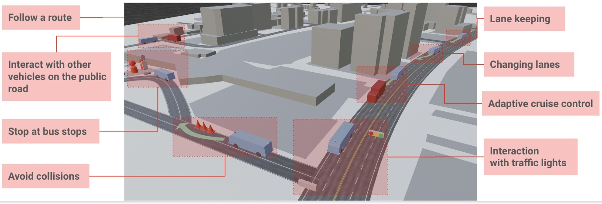

# Concept of Operations

## Passenger Transportation System in the urban area

The system, under the surveillance of an in-car operator, will automatically transport passengers while following routes on public roads. The public roads have multiple lanes, traffic lights, and intersections; therefore the system will automatically change lanes and respond to traffic lights at intersections. The system will automatically stop at bus stops. The system is programmed to avoid colliding with objects that are detected on the road. The vehicle is programmed to either safely pass the object when possible, or to stop. While the vehicle is moving, the system automatically maintains a safe following distance and stays within the speed limit (i.e., adaptive cruise control).

