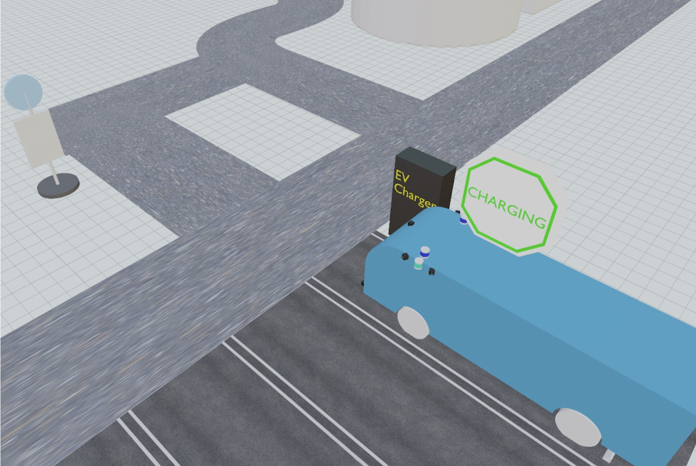

# Daytime operation

Currently, the system does NOT operate in the daytime.

In the future, the system will be able to operate during the daytime (9:30am - 3:30pm).

The vehicle will be fully charged before the operation in the daytime.

The operator connects the charger to the vehicle, and the vehicle is automatically charged.

