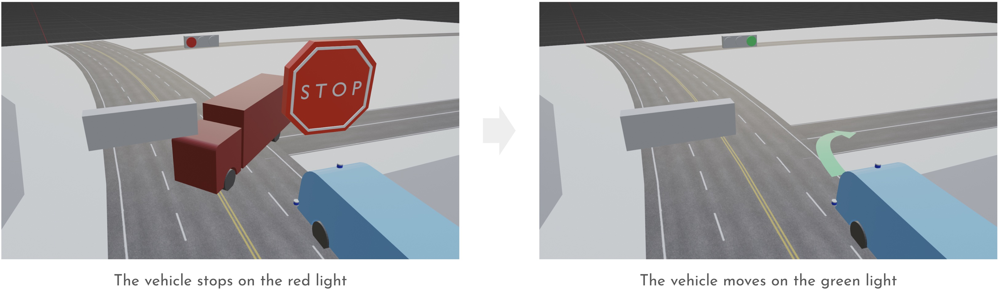

# Interact with traffic lights

When the vehicle meets a traffic light, the system performs one of the following actions:

- Stop on a red light
- Stop on a yellow light
- Go straight, turn right, or turn left on a green light or arrow

