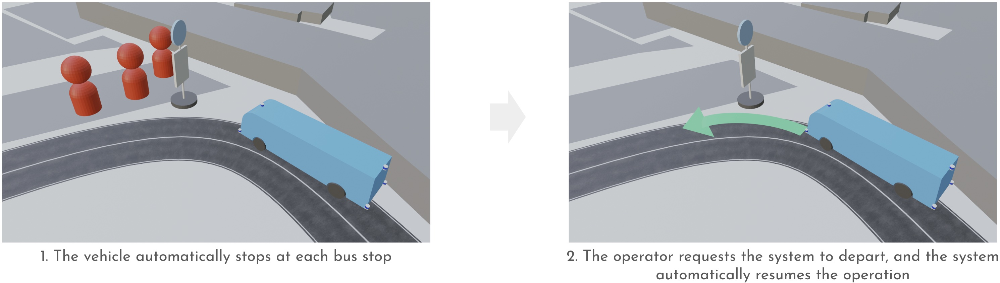

# Let passengers on and off at bus stops

The system stops at bus stops set by the in-car operator.

The in-car operator manually opens and closes the door of the vehicle to let passengers on and off at bus stops due to the local government’s request.

After the in-car operator requests the system to depart, the system automatically resumes driving along the route.

