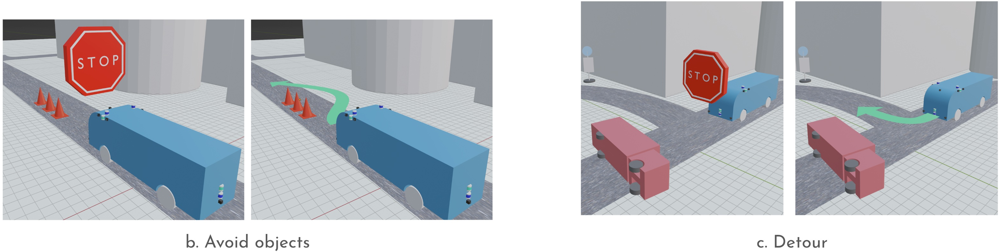

# Take over request to the operator

When the system cannot judge whether it can move forward, the system sends a recommendation to hand over operation to the in-car operator.

The operator is supposed to perform the following actions when requested by the system:

- Request to depart（refer to [Let passengers on and off at bus-stops](../let-passengers-on-and-off-at-bus-stops/index.md)）
- Avoid objects
- Detour

