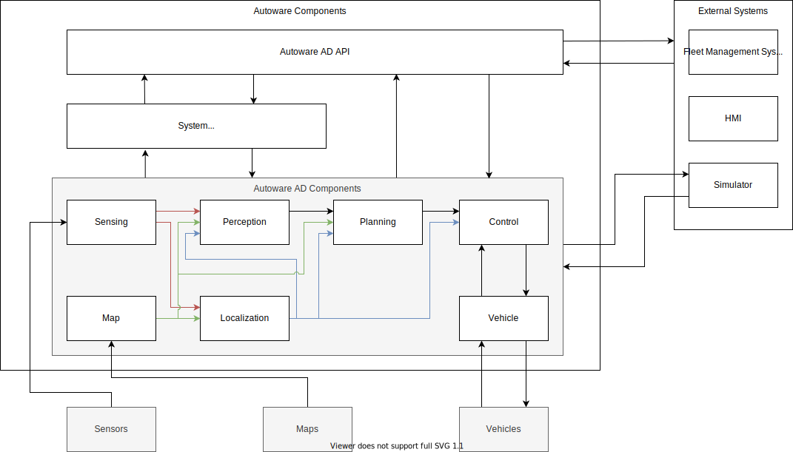

# Component architecture

## Overview

The figure below is the overview of Autoware's component configuration (tentative).

## Autoware components

TODO(Tier IV): Write the details based on the following materials.

- [Autoware.Auto](https://autowarefoundation.gitlab.io/autoware.auto/AutowareAuto/design.html)
- [autoware_auto_msgs](https://gitlab.com/autowarefoundation/autoware.auto/autoware_auto_msgs)
- [Tier IV's proposal document](https://github.com/tier4/autoware.proj/blob/main/docs/design/software_architecture/Overview.md)
- [Tier IV's proposal implementation](https://github.com/tier4/AutowareArchitectureProposal.iv/commits/use-autoware-auto-msgs)

### Map

Inputs:

- Map file
  - PointCloud map file
  - Vector map file

Outputs:

- Map data
  - PointCloud map file
  - Vector map file

### Sensing

Inputs:

- Raw sensor data
  - GNSS
  - IMU
  - Camera
  - LiDAR
  - RADAR
- Estimated self motion
  - To filter distortions

Outputs:

- Preprocessed sensor data
  - GNSS pose and doppler velocity
  - IMU acceleration and angular velocity
  - Camera image
  - LiDAR PointCloud
  - RADAR reflection

### Localization

Inputs:

- Preprocessed sensor data
  - GNSS pose and doppler velocity
  - IMU acceleration and angular velocity
  - Camera image
  - LiDAR PointCloud
  - RADAR reflection
- Map data
  - PointCloud map
  - Vector map

Outputs:

- Localized self pose
  - Topic
  - TF
- Estimated self motion

### Perception

Inputs:

- Localized self pose
- Estimated self motion
- Preprocessed sensor data
  - Camera image
  - LiDAR PointCloud
  - RADAR reflection

Outputs:

- Detected dynamic objects
- Detected traffic lights
- Filtered obstacle PointCloud

### Planning

Inputs:

- Localized pose
- Estimated self motion

Outputs:

- Planned trajectory
- Planning status

### Control

Inputs:

- Localized self pose
- Estimated self motion
- Planner trajectory
- Vehicle sensor data
  - velocity
  - steering angle

Outputs:

- Control commands
  - High-level commands for easy usage
  - Low-level commands for detailed controls

### Vehicle

#### Autoware to Vehicle

Inputs:

- Control commands

Outputs:

- Raw vehicle control commands

#### Vehicle to Autoware

Inputs:

- Raw vehicle sensor data (e.g. CAN)

Outputs:

- Vehicle sensor data (Topic)

### System

Inputs:

- Each component output

Outputs:

- System status
- MRM request
