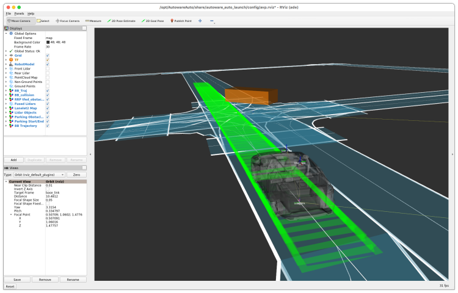

# Limitations and issues

## Limitations

- Simulation by using LGSVL is not supported because a map for scenario simulator (`kashiwanoha`) is not registered in LGSVL Simulator Content Store.

## Issues

- The ego vehicle drives slowly.

- `UC-001-0018-Kashiwa:1` failed with simulation timeout. The ego vehicle gets stuck after NPC crossed ahead of the ego vehicle. This might be caused by the slow driving.

  
