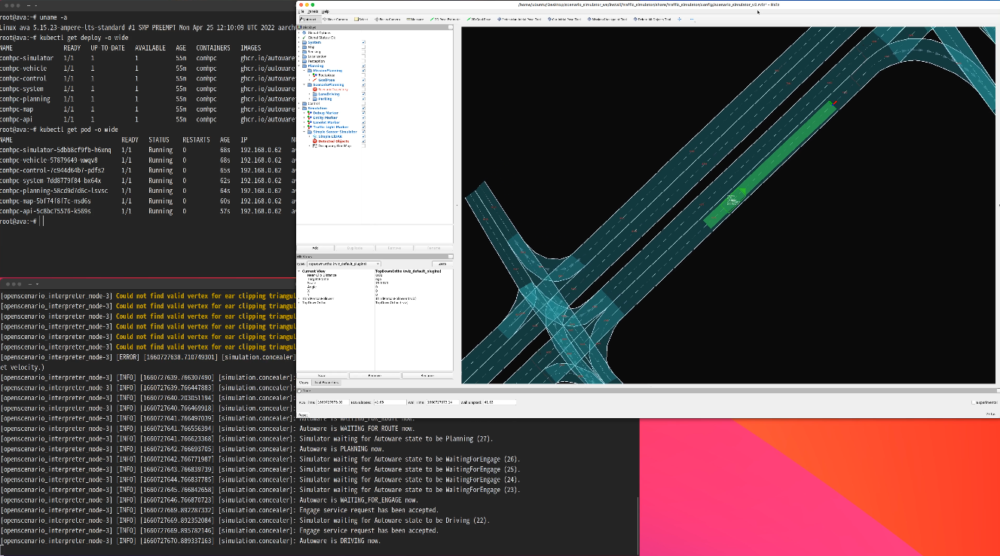

# Run on your local environment

This page describes how to run the scenario simulator on the developer platform that is set up in the Installation chapter.

## Minimum requirements

- Developer Platform: TODO
- In-Vehicle Development Platform [^1]: TODO
- Software Tool: TODO
- Container Image: TODO
- Data Pipeline: TODO

[^1]: This is optional if you do NOT need a vehicle-edge platform.

## Run scenario simulator on the developer platform

1. Launch scenario simulator.

   ```console
   rocker --x11 --home --network host --privileged ghcr.io/tier4/scenario_simulator_v2:galactic ros2 launch scenario_test_runner scenario_test_runner.launch.py scenario:=$HOME/Downloads/sample_data/t4v2.yaml architecture_type:=awf/universe launch_rviz:=true launch_autoware:=false record:=false timeout:=60.0
   ```

   :warning: Please specify the path to your scenario file.

   ```console
   scenario:=$HOME/Downloads/sample_data/t4v2.yaml
   ```

Now you can see...

[DEMO Video](../../installation/images/run-autoware/demo.mp4)


