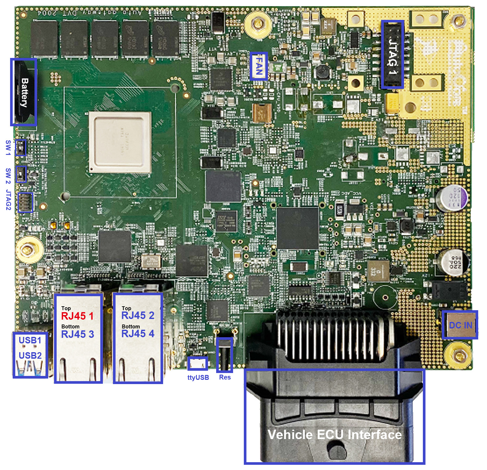
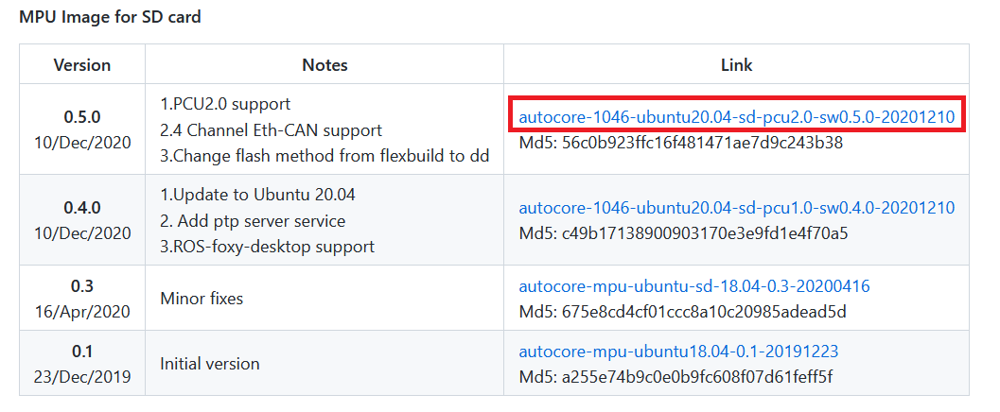
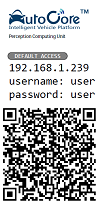
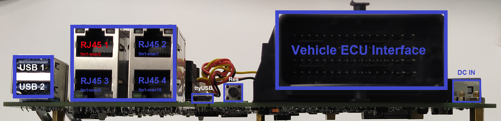
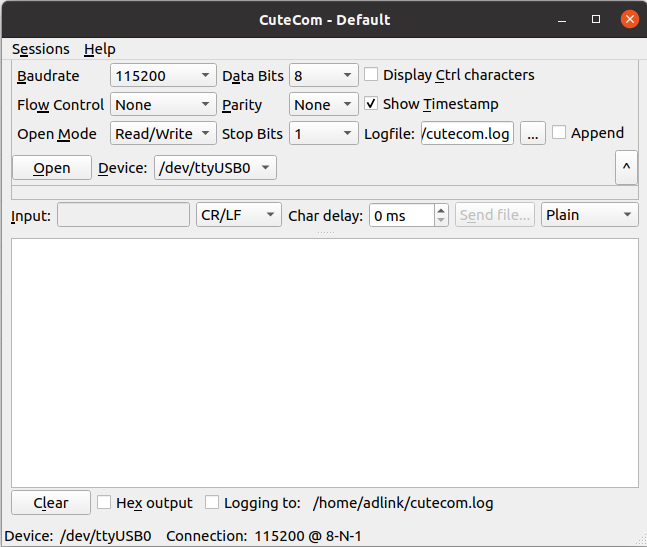

# Getting started with PCU

## Overview

_Reference: [PCU Setup Guide](https://github.com/autocore-ai/autocore_pcu_doc/blob/master/docs/Pcu_setup.md)_

This instruction explains how to boot up Ubuntu on PCU and access it from host PC.

- If you are using onboard 64G EMMC as boot device, it's already been pre-installed with Ubuntu 20.04, and you can skip this step;

- If you would like to boot from SD card, you could either request a Micro SD card with pre-installed system or flash by yourself under instructions in below section.  
  :white_check_mark: `Ubuntu 20.04` is preferred.

## Hardware Setup

The minimum recommended External Micro SD card size is 64GB, and the speed should be at least class 10 A1, it is strongly recommended to use high speed SD card, e.g. class U3, A2.

To boot from SD card, "SW1" should be set as: `ON`, and SD card should be plugged in.


For blank SD card, the system image need to be flashed first using another PC.

## Get MPU image

Official images with recommended OS are available on PCU Resource Download page.

[Resource Download Page](https://github.com/autocore-ai/autocore_pcu_doc/blob/master/docs/Resource_download.md#mpu-images)

For PCU 2.0 hardware, please download the MPU image file for SD card as marked red to your local storage.



## Flash MPU image

To flash MPU image on SD card, you will need a PC with a micro SD card reader.

This step could be done on either Windows or Linux PC with different flash tools.

Linux will be used in this instruction as example:

1. Insert card reader with target micro SD card to host PC.

1. Find out device name for the SD card.

   ```console
   sudo lsblk
   NAME   MAJ:MIN RM   SIZE RO TYPE MOUNTPOINT
   ...
   sda      8:0    0 238.5G  0 disk
   ├─sda1   8:1    0   512M  0 part /boot/efi
   └─sda2   8:2    0   238G  0 part /
   sdb      8:16   0 447.1G  0 disk
   ├─sdb1   8:17   0 428.4G  0 part
   ├─sdb2   8:18   0   513M  0 part
   └─sdb3   8:19   0  18.2G  0 part
   sdc      8:32   1  14.9G  0 disk
   └─sdc1   8:33   1  14.9G  0 part /media/adlink/B4A1-62CD
   ```

   :speech_balloon: In this case, `sdc` is the device name

1. Flash image to SD card.

   ```console
   sudo gzip -dc YOUR-DOWNLOAD-PATH/xxx.gz |sudo dd of=/dev/YOUR-DEVICE
   ```

   For example;

   ```console
   sudo gzip -dc ~/Downloads/autocore-1046-ubuntu20.04-sd-pcu2.0-sw0.5.0-20201210.gz |sudo dd of=/dev/sdc
   ```

   Wait patiently until the flash process finishes, this may take up to half hour.

1. Boot up.

   Now you can plug in the SD card to PCU and power up. The system should be ready to work.

## Connect To PCU via SSH

You could connect to PCU via SSh either by ethernet or serial port.

The default username, password and IP address of PCU is as below:


### SSH through ethernet

1. Cable connection

   Connect host PC to RJ45 2 / RJ45 3 / RJ45 4 Eth port (Blue) on PCU board with Ethernet cable (GbE, need Cat.5e or above).

   

1. Configure static IP for host PC  
   You need to manually configure static IP for PC in order to connect with PCU, as there is no DHCP server running on PCU. The static IP should be different with PCU and within the same network segment. (e.g. 192.168.1.200)

   

1. SSH login

   ```console
   ssh user@192.168.1.239
   ```

### SSH through Serial Port

1. Cable connection

   As an alternative, you could also choose to connect to PCU by micro USB (ttyUSB port in figure blow).

   

1. ttyUSB Settings

   For Linux users, you could use "cutecom" to connect to PCU.

   ```console
   sudo apt install cutecom
   cutecom
   ```

   Please set parameters as follows, `Device` shall be chosen based on your host PC.

   

   For other system users, the parameters are:

   | Parameter             | Value  |
   | --------------------- | ------ |
   | Baudrate              | 115200 |
   | Data                  | 8      |
   | Stop bit              | 1      |
   | Parity                | None   |
   | Hardware flow control | no     |
   | Software flow control | no     |

1. Reset PCU and Login

   Press reset button and wait until login.

   ```console
   ssh user@192.168.1.239
   ```

## Check PCU public IP Address

Connect PCU to internet via RJ45 1 Eth port (Red), this Eth port is configured to obtain IP address automatically from DHCP by default.

From section above, you can SSH connect to PCU, and you can look for IP address of the public ethernet port(fm1-mac5).

```console
ifconfig fm1-mac5
fm1-mac5: flags=4163<UP,BROADCAST,RUNNING,MULTICAST>  mtu 1500
  inet 192.168.10.221  netmask 255.255.255.0  broadcast 192.168.10.255
  inet6 fe80::204:7cff:fe2e:191  prefixlen 64  scopeid 0x20<link>
  ether 00:04:7c:2e:01:91  txqueuelen 1000  (Ethernet)
  RX packets 2806  bytes 3665212 (3.6 MB)
  RX errors 0  dropped 0  overruns 0  frame 0
  TX packets 2238  bytes 175964 (175.9 KB)
  TX errors 0  dropped 0 overruns 0  carrier 0  collisions 0
  device memory 0x1ae8000-1ae8fff
```

:speech_balloon: You can find IP address of PCU such as `192.168.10.221`.
