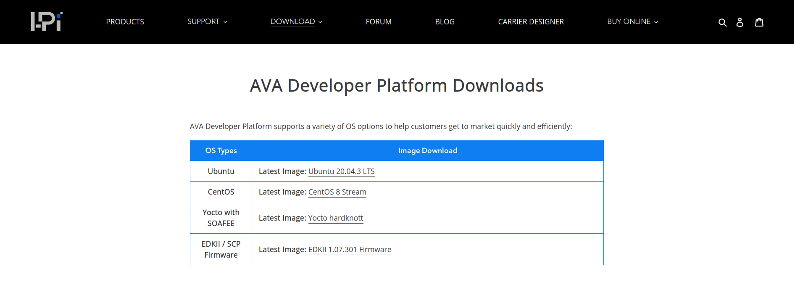
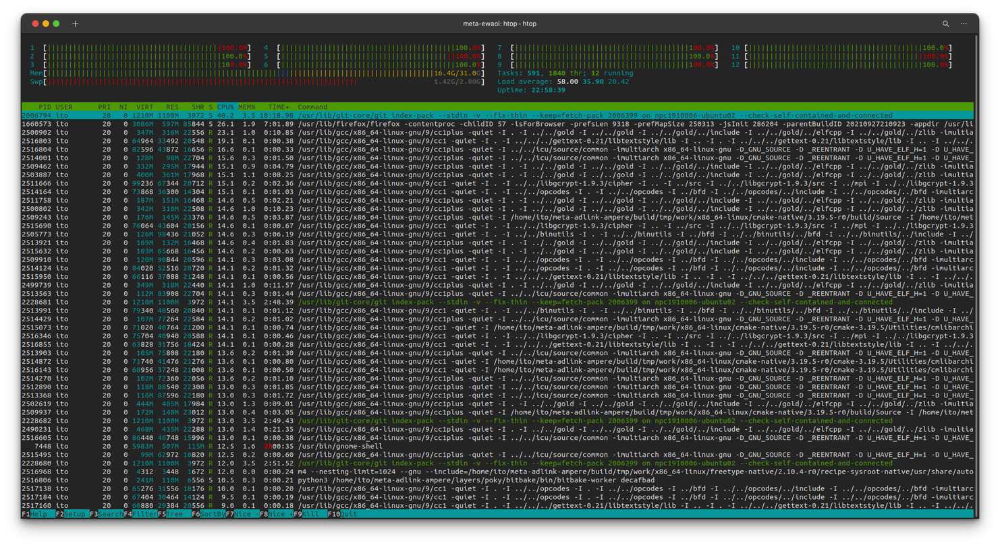

# Getting started with EWAOL

## Overview

_Reference: [Project Quickstart — EWAOL documentationn](https://ewaol.sites.arm.com/meta-ewaol/quickstart.html)_

This instruction explain how to build yocto image with EWAOL on your host machine.
If you are using [AVA Developer Platform](https://www.ipi.wiki/pages/com-hpc-altra), you can also download built image from ADLINK's website, and you can skip this steps;

- [AVA Developer Platform Downloads – I-Pi SMARC](https://www.ipi.wiki/pages/download-ava-developer-platform)
  
  :white_check_mark: `Yocto with SOAFEE` is preferred.

## Build Host Setup

1. Install required packages for the build host by following [The Yocto Project ® 3.3.1 documentation](https://docs.yoctoproject.org/3.3.1/singleindex.html#required-packages-for-the-build-host).

   ```console
   sudo apt-get install gawk wget git diffstat unzip texinfo gcc build-essential chrpath socat cpio python3 python3-pip python3-pexpect xz-utils debianutils iputils-ping python3-git python3-jinja2 libegl1-mesa libsdl1.2-dev pylint3 xterm python3-subunit mesa-common-dev
   ```

1. Install the kas setup tool.

   ```console
   sudo -H pip3 install kas
   ```

## Checkout the repository for AVA platform

1. [ADLINK / meta-adlink-ampere](https://github.com/ADLINK/meta-adlink-ampere)

   ```console
   git clone https://github.com/ADLINK/meta-adlink-ampere.git
   ```

1. [EWAOL / meta-ewaol](https://git.gitlab.arm.com/ewaol/meta-ewaol)

   ```console
   cd meta-adlink-ampere
   git clone https://git.gitlab.arm.com/ewaol/meta-ewaol.git
   ```

1. Build via kas

   ```console
   kas build ComHpc.yml
   ```

:warning: You should be careful of utilizing full CPU power during build.


**You can choose the way to boot EWAOL, SSD Boot(highly recommended) or USB Boot.**

- :white_check_mark: **SSD Boot (highly recommended)**
  - You need to use SSD enclosure case to flash yocto image to M.2 SSD directly.
- USB Boot

  - You need to use 32GB USB, not 64GB USB to flash yocto image.

    :warning: Do not use 64GB USB because bios gets stuck due to EDKII bug.
