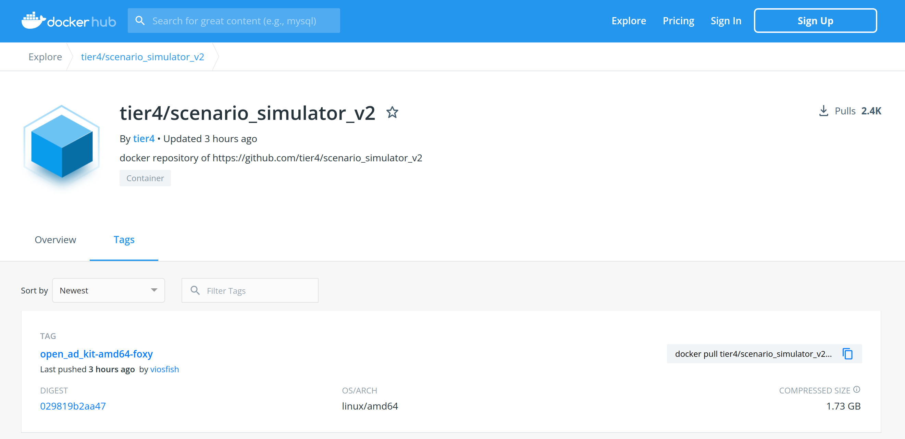
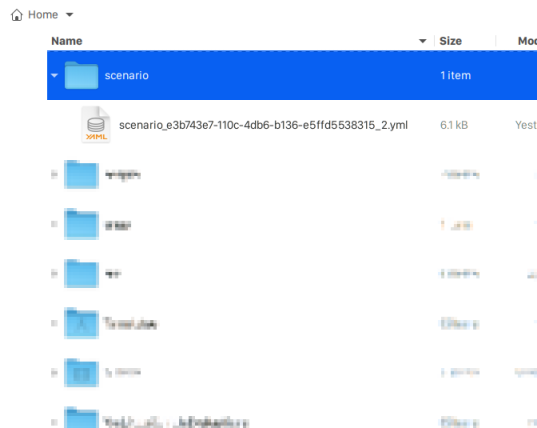
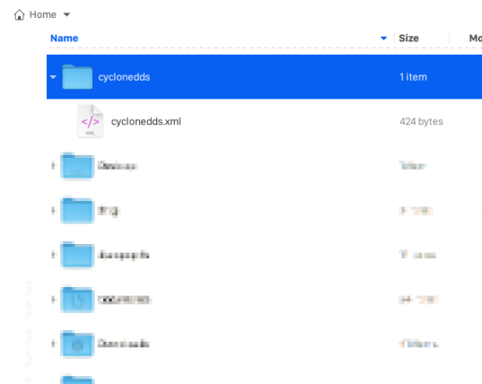

# System Setup on your host

## Overview

This instruction explans how to perform system setup for test execution on your host.

You need to copy docker images and neccesary files, and checkout Autoware.Auto.

## Copy scenario simulator image to your host machine

The docker image of scenario simulator is registered in [docker hub](https://hub.docker.com/r/tier4/scenario_simulator_v2/tags).


1. Copy docker image to your host machine.

   ```console
   docker pull tier4/scenario_simulator_v2:open_ad_kit-amd64-foxy
   ```

## Copy neccesary files to your host machine

1. Copy **scenario** files for scenario simulator.

   Files are placed in the directory :file_folder:[docs/Appendix/Open-AD-Kit-Start-Guide/scenario](scenario)

   **[Currently placed]**

   - :page_facing_up:[UC-001-0001-Kashiwa:2](scenario/scenario_e3b743e7-110c-4db6-b136-e5ffd5538315_2.yml)
   - :page_facing_up:[UC-001-0018-Kashiwa:1](scenario/scenario_a7effa60-c07d-4df4-b082-bc0d6cbae825_1.yml)

   Copy the scenario files to your `home` directory as the following directory structure.

   

1. Copy configuration file of **Cyclone DDS**.

   You also need to copy `cyclonedds.xml` to your `home` directory.

   

1. Copy **kernel configuration** file to `/etc/sysctl.d`.

   You also need to copy `60_cyclonedds.conf` to `/etc/sysctl.d` directory in your host as well.

   ```console
   cp 60_cyclonedds.conf /etc/sysctl.d
   ```

1. Update kernel parameters.

   ```console
   sysctl -p /etc/sysctl.d/60_cyclonedds.conf
   ```

## Modify `cyclonedds.xml`

You need to change the element `NetworkInterfaceAddress` to the network interface currently in use.

1. Find network interface.

   ```console
   ip addr
   1: lo: <LOOPBACK,MULTICAST,UP,LOWER_UP> mtu 65536 qdisc noqueue state UNKNOWN group default qlen 1000
       link/loopback 00:00:00:00:00:00 brd 00:00:00:00:00:00
       inet 127.0.0.1/8 scope host lo
          valid_lft forever preferred_lft forever
       inet6 ::1/128 scope host
          valid_lft forever preferred_lft forever
    2: enp0s31f6: <BROADCAST,MULTICAST,UP,LOWER_UP> mtu 1500 qdisc fq_codel state UP group default qlen 1000
       link/ether 66:77:88:99:aa:bb brd ff:ff:ff:ff:ff:ff
       inet 192.168.10.1/24 brd 192.168.10.255 scope global noprefixroute enp0s31f6
          valid_lft forever preferred_lft forever
       inet6 fe80::f15d:4196:b777:6875/64 scope link noprefixroute
          valid_lft forever preferred_lft forever
    3: wlp82s0: <BROADCAST,MULTICAST,UP,LOWER_UP> mtu 1500 qdisc noqueue state UP group default qlen 1000
       link/ether cc:dd:ee:ff:00:01 brd ff:ff:ff:ff:ff:ff
       inet 192.168.0.28/24 brd 192.168.0.255 scope global dynamic noprefixroute wlp82s0
          valid_lft 3137sec preferred_lft 3137sec
       inet6 fe80::f493:f223:dfcc:bd1b/64 scope link noprefixroute
          valid_lft forever preferred_lft forever
    4: docker0: <NO-CARRIER,BROADCAST,MULTICAST,UP> mtu 1500 qdisc noqueue state DOWN group default
       link/ether 23:45:67:89:ab:cd brd ff:ff:ff:ff:ff:ff
       inet 172.17.0.1/16 brd 172.17.255.255 scope global docker0
          valid_lft forever preferred_lft forever
   ```

   :speech_balloon: You can find inetwork interface such as `enp0s31f6`.

1. Change the `NetworkInterfaceAddress`.

   ```console
   vi ~/cyclonedds/cyclonedds.xml
   ```

   For example; :page_facing_up: cyclonedds.xml

   ```diff
    <General>
   -  <NetworkInterfaceAddress>lo</NetworkInterfaceAddress>
   +  <NetworkInterfaceAddress>enp0s31f6</NetworkInterfaceAddress>
    </General>

   ```

## Setup ADE

**In general, Autoware.Auto runs by using the Agile Development Environment (ADE), so we need to install ADE.**

In this test, we use launch flle placed in Autoware.Auto to run visuzalization quickly and easily.

1. Install ADE on AVA platform by following the instructions; [Installation — ADE 4.4.0dev documentation](https://ade-cli.readthedocs.io/en/latest/install.html)

   Download and setup ADE.

   ```console
   wget https://gitlab.com/ApexAI/ade-cli/-/jobs/1341322852/artifacts/raw/dist/ade+aarch64 -O ade
   chmod +x ade
   mv ade /usr/bin/
   ```

1. Setup ADE home directory by following the instructions; [Installation with ADE](https://autowarefoundation.gitlab.io/autoware.auto/AutowareAuto/installation-ade.html)

   ```console
   mkdir -p ~/adehome
   cd ~/adehome
   touch .adehome
   ```

## Checkout Autoware.Auto

1. Get Autoware.Auto on your host.

   ```console
   cd ~/adehome
   git clone https://gitlab.com/autowarefoundation/autoware.auto/AutowareAuto.git
   ```
