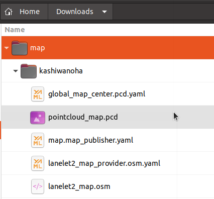
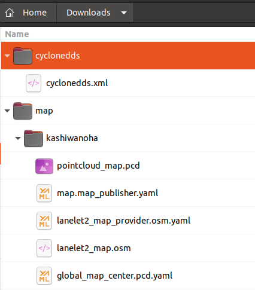

# System Setup on PCU

## Overview

This instruction explans how to perform system setup for test execution on PCU.

You need to install Docker Engine, copy docker images and neccesary files.

## Access to PCU via SSH

```console
ssh user@IP-ADDRESS
```

For example;

```console
ssh user@192.168.10.221
```

## Copy Autoware.Auto image to PCU

**NOTE**: docker should be installed with post-installation steps. For instructions please refer to:

- [Install Docker Engine on Ubuntu](https://docs.docker.com/engine/install/ubuntu).
- [Post-installation steps for Linux](https://docs.docker.com/engine/install/linux-postinstall).

The docker image of Autoware.Auto is registered in [GitLab Container Registry](https://gitlab.com/autowarefoundation/autoware.auto/AutowareAuto/container_registry/2511358).


1. Copy docker image to PCU.

   ```console
   docker pull registry.gitlab.com/autowarefoundation/autoware.auto/autowareauto/arm64/openadkit-foxy:latest
   ```

## Copy neccesary files to lcoal Downloads folder

1. Copy files related to **map contents**.

   Files are placed in the directory :file_folder:[docs/Appendix/Open-AD-Kit-Start-Guide/map](map)

   - :page_facing_up:[lanelet2_map.osm](map/kashiwanoha/lanelet2_map.osm)
   - :page_facing_up:[pointcloud_map.pcd](map/kashiwanoha/pointcloud_map.pcd)
   - :page_facing_up:[global_map_center.pcd.yaml](map/kashiwanoha/global_map_center.pcd.yaml)
   - :page_facing_up:[lanelet2_map_provider.osm.yaml](map/kashiwanoha/lanelet2_map_provider.osm.yaml)
   - :page_facing_up:[map.map_publisher.yaml](map/kashiwanoha/map.map_publisher.yaml)

   Copy files to your local folder (Downloads folder as example) as the following directory structure.

   

1. Copy configuration file of **Cyclone DDS**.

   In this test, we are using Cyclone DDS, so you also need to copy configuration file of Cyclone DDS.

   File is placed in the directory :file_folder:[docs/Appendix/Open-AD-Kit-Start-Guide/cyclonedds](cyclonedds)

   - :page_facing_up:[cyclonedds.xml](cyclonedds/cyclonedds.xml)

   Copy the file to your local folder as the following directory structure.

   

1. Copy **kernel configuration** file for tuning kernel parameters.

   We have to reconfigure kernel parameters by using `sysctl` for system stability.

   File is placed in the directory :file_folder:[docs/Appendix/Open-AD-Kit-Start-Guide/sysctl.d](sysctl.d)

   - :page_facing_up:[60_cyclonedds.conf](sysctl.d/60_cyclonedds.conf)

   Copy the file to your local folder.

## Copy files from local folder to PCU

1. Connect your host PC with PCU through internet and copy files with SCP.

   1. Access to PCU via SSH

      For example;

      ```console
      ssh user@192.168.10.221
      ```

   1. Cpoy kernel configuration file to `/etc/sysctl.d/`

      ```console
      sudo scp USER-NAME@IP-ADDRESS:/home/USER-NAME/Downloads/60_cyclonedds.conf /etc/sysctl.d/
      ```

      For example;

      ```console
      sudo scp adlink@192.168.10.237:/home/adlink/Downloads/60_cyclonedds.conf /etc/sysctl.d/
      ```

      Then type in the password of PCU (default password: user) and host PC as request.

   1. Update kernel parameters.

      ```console
      sudo sysctl -p /etc/sysctl.d/60_cyclonedds.conf
      ```

   1. Copy **map contents** files and **Cyclone DDS** configuration file.

      ```console
      sudo scp -r USER-NAME@IP-ADDRESS:/home/adlink/Downloads/map ~/
      ```

      ```console
      sudo scp -r USER-NAME@IP-ADDRESS:/home/adlink/Downloads/cyclonedds ~/
      ```

## Modify `cyclonedds.xml`

You need to change the element `NetworkInterfaceAddress` to the network interface currently in use.

1. Find network interface.

   ```console
   ip addr
   1: lo: <LOOPBACK,UP,LOWER_UP> mtu 65536 qdisc noqueue state UNKNOWN group default qlen 1000
      link/loopback 00:00:00:00:00:00 brd 00:00:00:00:00:00
      inet 127.0.0.1/8 scope host lo
        valid_lft forever preferred_lft forever
      inet6 ::1/128 scope host
        valid_lft forever preferred_lft forever
   2: fm1-mac1: <NO-CARRIER,BROADCAST,MULTICAST,UP> mtu 1500 qdisc mq master br0 state DOWN group default qlen 1000
      link/ether 00:04:7c:2e:01:90 brd ff:ff:ff:ff:ff:ff
      inet6 fe80::204:7cff:fe2e:190/64 scope link
        valid_lft forever preferred_lft forever
   3: fm1-mac5: <BROADCAST,MULTICAST,UP,LOWER_UP> mtu 1500 qdisc mq state UP group default qlen 1000
      link/ether 00:04:7c:2e:01:91 brd ff:ff:ff:ff:ff:ff
      inet 192.168.10.221/24 brd 192.168.10.255 scope global dynamic fm1-mac5
        valid_lft 254392sec preferred_lft 254392sec
      inet6 fe80::204:7cff:fe2e:191/64 scope link
        valid_lft forever preferred_lft forever
   4: fm1-mac6: <NO-CARRIER,BROADCAST,MULTICAST,UP> mtu 1500 qdisc mq master br0 state DOWN group default qlen 1000
      link/ether 00:04:7c:2e:01:90 brd ff:ff:ff:ff:ff:ff
   5: fm1-sw: <BROADCAST,MULTICAST,UP,LOWER_UP> mtu 1500 qdisc mq master br0 state UP group default qlen 1000
      link/ether 00:04:7c:2e:01:90 brd ff:ff:ff:ff:ff:ff
      inet6 fe80::204:7cff:fe2e:190/64 scope link
          alid_lft forever preferred_lft forever
   6: fm1-mac10: <NO-CARRIER,BROADCAST,MULTICAST,UP> mtu 1500 qdisc mq master br0 state DOWN group default qlen 1000
      link/ether 00:04:7c:2e:01:90 brd ff:ff:ff:ff:ff:ff
   7: sit0@NONE: <NOARP> mtu 1480 qdisc noop state DOWN group default qlen 1000
      link/sit 0.0.0.0 brd 0.0.0.0
   8: br0: <BROADCAST,MULTICAST,UP,LOWER_UP> mtu 1500 qdisc noqueue state UP group default qlen 1000
      link/ether 00:04:7c:2e:01:90 brd ff:ff:ff:ff:ff:ff
      inet 192.168.1.239/24 brd 192.168.1.255 scope global br0
        valid_lft forever preferred_lft forever
      inet6 fe80::204:7cff:fe2e:190/64 scope link
        valid_lft forever preferred_lft forever
   9: docker0: <NO-CARRIER,BROADCAST,MULTICAST,UP> mtu 1500 qdisc noqueue state DOWN group default
      link/ether 02:42:cb:aa:a6:9d brd ff:ff:ff:ff:ff:ff
      inet 172.17.0.1/16 brd 172.17.255.255 scope global docker0
        valid_lft forever preferred_lft forever
   ```

   :speech_balloon: You can find inetwork interface such as `fm1-mac5`.

1. Change the `NetworkInterfaceAddress`.

   ```console
   sudo vi ~/cyclonedds/cyclonedds.xml
   ```

   For example; :page_facing_up: cyclonedds.xml

   ```diff
    <General>
   -  <NetworkInterfaceAddress>lo</NetworkInterfaceAddress>
   +  <NetworkInterfaceAddress>fm1-mac5</NetworkInterfaceAddress>
    </General>

   ```
