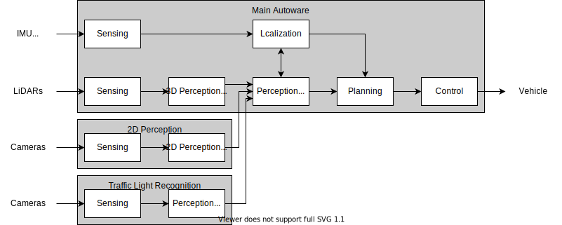

# High-level Architecture

This is a draft version.

## Overview

The reference system consists of three parts of computing unit.

- Main Autoware
- 2D Perception
- Traffic Light Recognition

Each unit can be implemented on separated hardware units (ECUs) and, if the hardware has sufficient system resource and performance, some units can also be integrated on a single hardware unit.

## Block Diagram

