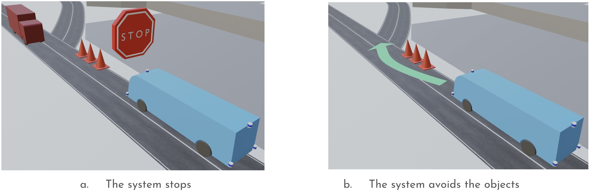

# Avoid collisions

When there are objects on the route, the system will automatically perform the following actions:

a. The system automatically stops if there is surrounding traffic.

b. The system automatically avoids the objects if there is no surrounding traffic.

