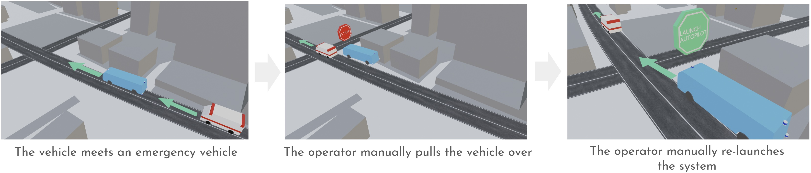

# Interact with emergency vehicles

When the vehicle meets an emergency vehicle, an in-car operator performs the following actions:

- Promptly maneuvers the vehicle to the side of the road and stops
- Manually re-launches the system after the emergency vehicle passes by
- NOTE: The operator can use HMI (e.g., steering wheel or brake pedal) at any time to override the system control.

