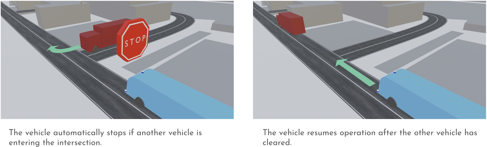

# Interact with other vehicles on the public roads

The service route uses public roads, so the system interacts with other vehicles and must obey all traffic laws.

When the vehicle approaches an intersection, the system is programed to yield and take right of way with surrounding traffic, depending the actual situation and traffic laws.

