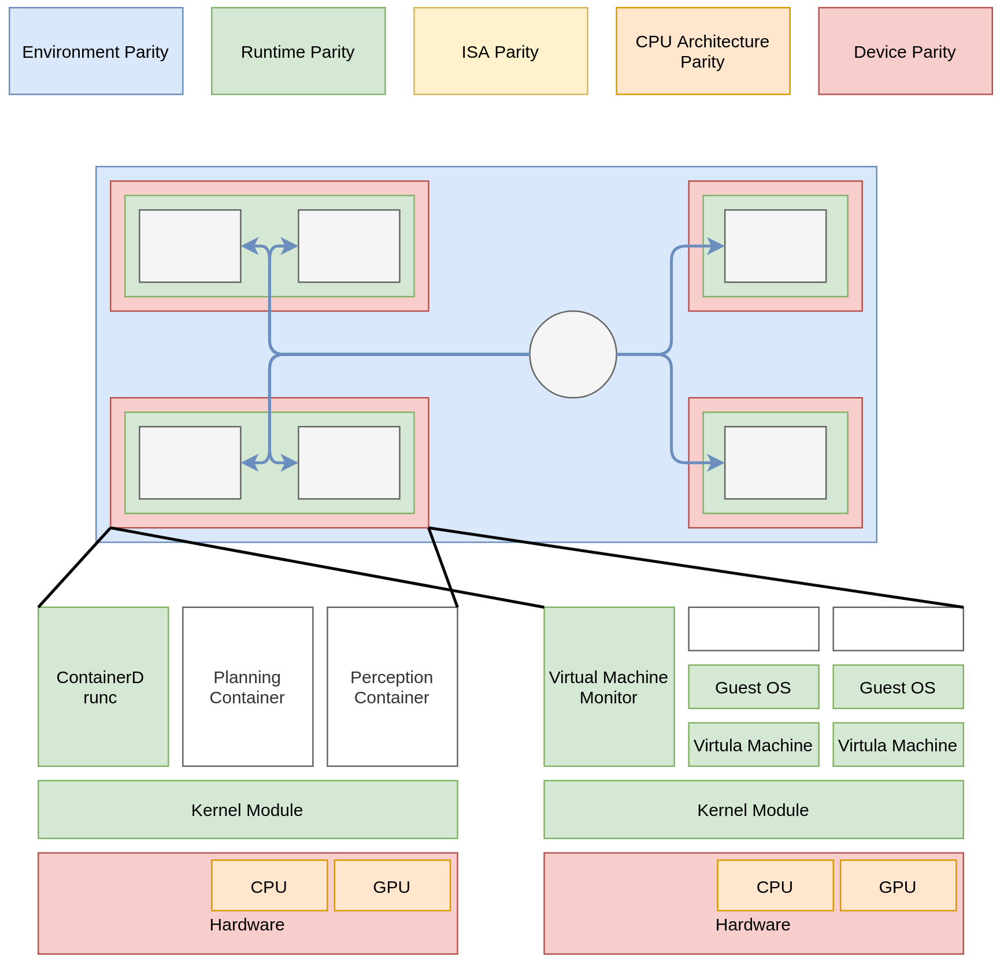

# Parity

## Importance of the parity in the verification of autonomous driving systems

One of the most important points in the verification process of the autonomous driving system is the guaranteed level of the parity between the edge (onboard) and the cloud (CI /CD) environment. Various types of the parity and the information that is useful in the verification architecture taking the parity into consideration 　 are explained.

## Parity types

### Device Parity

The parity of the hardware (machines). When using the public cloud, as the device variation available on the public cloud is generally limited, it is difficult to guarantee this device parity.

### CPU Architecture Parity

The parity of the processor implementation including the microservice architecture and the clock speed, etc.

### ISA Parity

The ISA (Instruction Set Architecture) Parity is different from the CPU Architecture Parity. It means the parity of the available register resource, instruction set, and the calculation functionality, where the processor implementation is abstracted.

### Runtime Parity

The Runtime Parity means the parity of the kernel module and the container runtime, where the built result at the application level is guaranteed to run flawlessly.

However, depending on the implementation, some modules do not run even if the Runtime Parity is secured. For example, the object detection module which is optimized for a GPU model.

### Environment Parity

The Environment Parity means the parity of the network configuration, set of frameworks and libraries of the autonomous driving system applications.

## Parity and Cloud Native DevOps

In autonomous driving system verification, it is important to conduct the necessary tests by understanding what level of parity is guaranteed for the verification environment compared to the vehicle environment.

On the other hand, in case that the public cloud is used as a cloud native environment, the Device Parity may not be fulfilled. Depending on the choice of the chip, the CPU Architecture Parity or the ISA Parity may not be met.

It is crucial to conduct tests in the bench environment while improving the development experience by executing the sufficient number of tests in a short time period in a cloud native manner.
