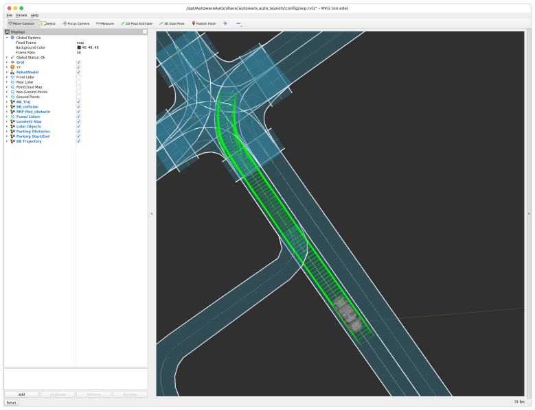

# Run on your local environment

This page describes how to run the scenario simulator on the developer platform that is set up in the Installation chapter.

## Minimum requirements

- Developer Platform: TODO
- In-Vehicle Development Platform [^1]: TODO
- Software Tool: TODO
- Container Image: TODO
- Data Pipeline: TODO

[^1]: This is optional if you do NOT need a vehicle-edge platform.

## Run visualization and scenario simulator on the developer platform

1. Run Rviz.

   You already cloned Autoware.Auto repository, navigate to the cloned directory.

   1. Launch ADE.

      ```console
      cd ~/adehome/AutowareAuto
      ade --rc .aderc-amd64-foxy-lgsvl start --update --enter
      ```

   1. Launch visualization in ADE.

      ```console
      source /opt/AutowareAuto/setup.bash
      ros2 launch autoware_auto_launch autoware_auto_visualization.launch.py
      ```

1. Find docker image id.

   ```console
   docker image ls
   REPOSITORY                                                                            TAG                                                                           IMAGE ID       CREATED       SIZE
   registry.gitlab.com/autowarefoundation/autoware.auto/autowareauto/amd64/binary-foxy   master                                                                        91512aa9e485   3 days ago    176MB
   registry.gitlab.com/autowarefoundation/autoware.auto/autowareauto/amd64/ade-foxy      master                                                                        0d9978b7113d   4 days ago    5.74GB
   scenario_simulator                                                                    open_ad_kit-autoware-auto-planning_sim_v2-20211111234534-88ea1196cdc0-2zv2o   d766a256a8c3   11 days ago   5.95GB
   registry.gitlab.com/autowarefoundation/autoware.auto/ade-lgsvl/foxy                   2021.3                                                                        077c172fa5b9   5 weeks ago   379MB

   ```

   You can find id such as `d766a256a8c3`.

1. Launch scenario simulator.

   Replace `/home/foo` with your home directory.

   Replace `d766a256a8c3` with your docker image id.

   ```console
   docker run --rm -it --net host -v /home/foo/scenario:/scenario -v /home/foo/cyclonedds:/etc/cyclonedds d766a256a8c3 /bin/bash -c "export CYCLONEDDS_URI=file:///etc/cyclonedds/cyclonedds.xml; export RMW_IMPLEMENTATION=rmw_cyclonedds_cpp; source install/setup.bash; ros2 launch scenario_test_runner scenario_test_runner.launch.py sensor_model:=aip_xx1 vehicle_model:=lexus launch_autoware:=false architecture_type:=awf/auto scenario:=/scenario/scenario_e3b743e7-110c-4db6-b136-e5ffd5538315_2.yml"
   ```

Now you can see...

[DEMO Video](../../installation/images/run-autoware/scenario_e3b743e7-110c-4db6-b136-e5ffd5538315_2.mp4)



[Demo on BlueBox 3.0](../../installation/images/run-autoware/Run_on_BlueBox3.0.mp4)
__NOTE__: According to the [limitations and issues](../limitations-and-issues/limitations-and-issues.md), the ego vehicle drives slowly. The demo video is x3 fast play.

