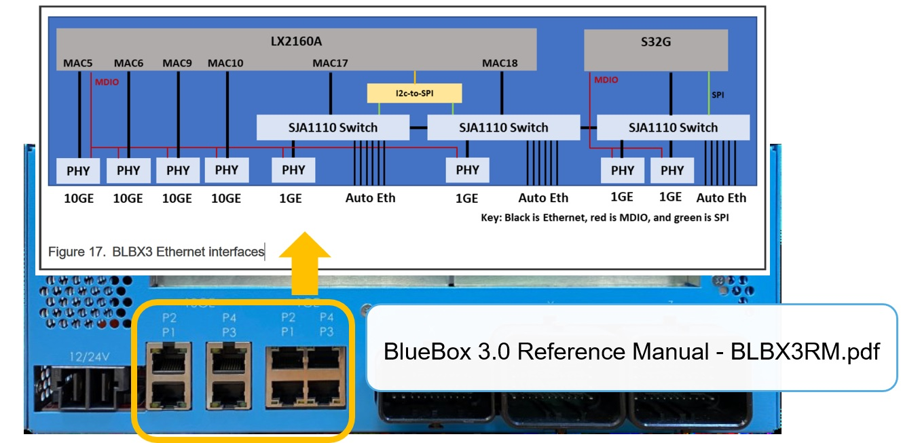
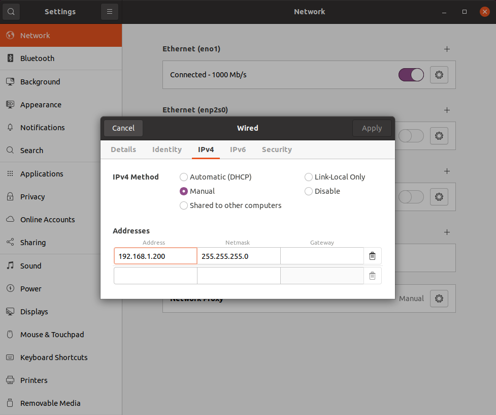

# Getting started with BlueBox 3.0

## Overview

_Reference: BlueBox3.0_LinuxBSP_Quick_Start_Guide_

**The BlueBox 3.0 requires authorization for purchase based on the intended use. Support for BlueBox 3.0 projects will be provided exclusively through the dedicated NXP Community, which also requires authorization to view. Please contact support for further assistance.**

The NXP BlueBox development platform delivers the performance and functional safety features required to build zonal architectures, high-performance computing systems, analyze driving environments, assess risk factors and then direct the self-driving car's behavior.

[Autoware on BlueBox platform demo](https://www.youtube.com/watch?v=eI5JizQT8h0&t=321s)

This instruction explains how to boot up Ubuntu on BlueBox 3.0 and access it from host PC.

## Hardware Setup

### Default DIP switch settings

The table below provides default settings of dual inline package (DIP) switches available in BlueBox 3.0. For each DIP switch:

- If the switch is positioned toward the digit, the logical value is 0

- If the switch is positioned toward the "ON" marking, the logical value is 1

Table 1. Default DIP switch settings

|  Switch  | Settings (0: OFF, 1: ON) |
| :------: | :----------------------: |
| SW1[1:8] |      1111_1110           |
| SW2[1:8] |      0000_0101           |
| SW3[1:8] |      0000_1010           |

With the default DIP switch settings (mentioned in the table above):

- The LX2160A SoC boots from FlexSPI NOR flash memory
  
- The S32G274A SoC boots from SD card, following a factory configuration stored in the EEPROM

### Booting LX2160A from SD card

To make LX2160A to boot from SD card, set DIP switch SW1[1:4] settings as shown in the table below.and SD card should be plugged in.

Table 2. SD card specific switch settings for LX2160A

|  Switch  | Settings (0: OFF, 1: ON) |
| :------: | :----------------------: |
| SW1[1:4] |      1000                |

## Booting with provided binaries

BlueBox 3.0 comes with a factory-installed Linux image for the LX2160A SoC and a preimaged bootable micro-SD card for the S32G274A SoC, meaning that you should be able to start the unit out-of-the-box. In addition, the BlueBox 3.0 ADSDK software release provides full SD Card image for BlueBox3-LX2160A and BlueBox3-S32G274A device, including pre-installed applications from BB ADAS SDK running on Ubuntu 18.04. To boot the SoCs using the SD card images, perform the following steps:

1. Download the required files:

    a. Download the SD card images from the BlueBox 3.0 ADSDK release location. You will find the following files:
    - lx2160abluebox3ubuntu_sdcard_image_0.6.0.tar.gz
    - s32g274abluebox3ubuntu_sdcard_image_0.6.0.tar.gz

2. Deploy the LX2160A and S32G274A standard images:
   
    For this step, you need a micro-SD card and a card reader.

    a. With the card inside, connect the card reader to your host Linux build machine. Ensure that it appears as a dedicated device inside the system.

    **_NOTE: To accurately identify this device, compare the output of the following command before and after inserting themicro-SD card (this will show the newly created device and its existing partitions):_**
    
    ```
    $ cat /proc/partitions
    ```

    **_NOTE: If your Linux distribution auto-mounts inserted SD cards, you must unmount any mounted partitions before writing an image to the card._**

    b. Write the LX2160A image (fsl-image-ubuntu-lx2160abluebox3.sdcard) directly onto the micro-SD card using the following command:

    ```
    $ sudo dd if=fsl-image-ubuntu-lx2160abluebox3.sdcard of=<SD-card-node> bs=1M && sy
    ```
    In the above command, \<SD-card-node\> is the device in use (for example, /dev/sdc).

    **_NOTE: If you encounter issues when using dd, consider using a third-party alternative, such as Win32 Disk Imager (available on both Linux and Windows)._**

    c. Insert the micro-SD card into the "LX2" SD port on BlueBox 3.0.

    d. Connect the UART to a serial line on your host machine and open a terminal emulator (communications) program.

    e. Make the appropriate DIP switch settings so that the LX2160A SoC boots directly from micro-SD card.

## Setup USB-UART connection on Host machine

1. USB to Quad-UART bridge driver needs to be installed on Windows hosts. On Linux host, the native USB to UART driver is used (usually /dev/ttyUSBxx).

   Windows host setup:
   - Download the FTDI driver from: https://ftdichip.com/drivers/vcp-drivers/
   - Install the UART Driver on host
   - Connect MicroUSB into the box for LX2/S32G UART connection
   - Connect to the emulated serial ports (COM)
   
      LX2 is first of the four displayed COM ports of LX2/S32G UART

      S32G is third of the four displayed COM ports of LX2/S32G UART

   - For COM port settings:
   
      Bits per second: 115200

      Data bits: 8

      Parity: None

      Stop bits: 1

      Flow control: None

2. Power up BlueBox 3.0. You should see the LX2160A SoC booting (in the terminal emulator).

3. After the LX2160A SoC has booted, use the username *bluebox* and password *bluebox* to log in. At this point, you will have successfully written the complete LX2160A environment on BlueBox 3.0.

## Connect To BlueBox 3.0 via SSH

SSH connection is supported for LX2 and S32G Ubuntu system by default.
You could connect to BlueBox 3.0 via SSh either by ethernet.

1. Cable connection
  
   Connect host PC to Eth port (Yellow) on BlueBox 3.0 board with Ethernet cable (GbE, need Cat.5e or above).

   

2. Configure static IP for host PC  
   You need to manually configure IP for PC in order to connect with BlueBox 3.0. Here is DHCP client running on LX2/S32G by default after boot-up. Check interface IP address obtained from DHCP server via serial console. The host PC static IP should be different with BlueBox 3.0 and within the same network segment. (e.g. 192.168.1.200)

   
   
3. SSH login
   For LX2:
   ```console
   $ ssh bluebox@[IP from DHCP]
   Password: bluebox
   ```
   For S32G:
   ```
   $ ssh bluebox@[IP from DHCP]
   Password: bluebox
   ```


