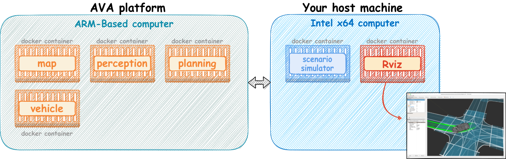

# Installation

This page explains how to set up the development environment that are described in the System Configuration chapter.

## Minimum requirements

- Developer Platform:
  - [AVA Platform](https://www.ipi.wiki/pages/com-hpc-altra), PCU Platform or [BlueBox 3.0](https://www.nxp.com/design/designs/bluebox-3-0-automotive-high-performance-compute-ahpc-development-platform:BlueBox)
- In-Vehicle Development Platform [^1]: TODO
- Software Tool:
  - Scenario simulator version x.x [^2]
  - Rviz version x.x [^2]
- Container Image:
  - [Autoware.Auto for arm64](https://github.com/autowarefoundation/autoware/pkgs/container/autoware-universe/26844652?tag=galactic-latest-prebuilt-cuda-arm64)
  - [Scenario simulator for x86_64](https://github.com/autowarefoundation/autoware/pkgs/container/autoware-universe/26944750?tag=galactic-latest-prebuilt-cuda) [^2]

[^1]: This is unnecessary if you do NOT need a vehicle-edge platform.
[^2]: This is unnecessary if you can use the cloud development platform, Web.Auto.

The following diagram shows a minimum configuration of Open AD Kit. "Your host machine" will be replaced by the cloud development platform if you can use Web.Auto.

## 1. Set up the developer platform

The setup procedure depends on the developer platform.

### AVA Platform

1. [Getting started with EWAOL](./getting-started.md)
1. [Boot EWAOL via SSD Boot](./boot-ewaol.md)
1. [Extend rootfs partition](./extend-rootfs.md)

### PCU Platform

1. [Getting started with PCU](./getting-started-pcu.md)

### BlueBox 3.0 Platform

1. [Getting started with BlueBox 3.0](./getting-started-bb_3_0.md)

## 2. Set up the in-vehicle platform

!!! note "If you do NOT need a vehicle-edge platform, please skip this step."

TODO

## 3. Install Autoware container images on the developer platform

### AVA Platform

1. [System setup on AVA Platform](./system-setup-ava.md)

### PCU Platform

1. [System setup on PCU](./system-setup-pcu.md)

### BlueBox 3.0 Platform

1. [System setup on BlueBox 3.0](./system-setup-bb_3_0.md)

## 4. Install Autoware container images on the in-vehicle platform

!!! note "If you do NOT need a vehicle-edge platform, please skip this step."

TODO

## 5. Set up software tools

!!! note "If you can use the cloud development platform, please skip this step."

### AVA Platform

1. [System setup on your host](./system-setup-host.md)

### PCU Platform

1. [System setup on your host](./system-setup-host.md)

### BlueBox 3.0 Platform

1. [System setup on your host](./system-setup-host.md)

## 6. Run Autoware on the development platform

Please refer to the [How to run Autoware](../how-to-run-autoware/index.md) section.
