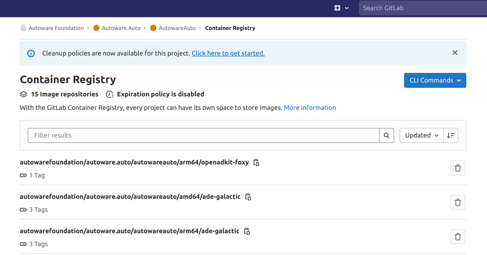
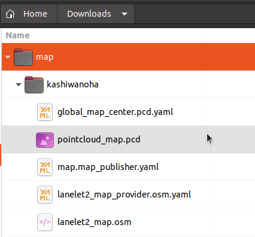

# System Setup on BlueBox 3.0

## Overview

This instruction explans how to perform system setup for test execution on BlueBox 3.0.

The Docker Engine is installed in fsl-image-ubuntu image by default, only need to copy docker images and neccesary files to BlueBox 3.0.

## Access to BlueBox 3.0 via SSH

```console
ssh bluebox@IP-ADDRESS
```

For example;

```console
ssh bluebox@192.168.1.21
```

## Copy Autoware.Auto image to BlueBox 3.0

**NOTE**: docker should be initialized with post-installation steps. For instructions please refer to:

- [Post-installation steps for Linux](https://docs.docker.com/engine/install/linux-postinstall).

The docker image of Autoware.Auto is registered in [GitLab Container Registry](https://gitlab.com/autowarefoundation/autoware.auto/AutowareAuto/container_registry/2511358).


1. Copy docker image to BlueBox 3.0.

   ```console
   docker pull registry.gitlab.com/autowarefoundation/autoware.auto/autowareauto/arm64/openadkit-foxy:latest
   ```

## Copy neccesary files to lcoal Downloads folder

1. Copy files related to **map contents**.

   Files are placed in the directory :file_folder:[docs/Appendix/Open-AD-Kit-Start-Guide/map](map)

   - :page_facing_up:[lanelet2_map.osm](map/kashiwanoha/lanelet2_map.osm)
   - :page_facing_up:[pointcloud_map.pcd](map/kashiwanoha/pointcloud_map.pcd)
   - :page_facing_up:[global_map_center.pcd.yaml](map/kashiwanoha/global_map_center.pcd.yaml)
   - :page_facing_up:[lanelet2_map_provider.osm.yaml](map/kashiwanoha/lanelet2_map_provider.osm.yaml)
   - :page_facing_up:[map.map_publisher.yaml](map/kashiwanoha/map.map_publisher.yaml)

   Copy files to your local folder (Downloads folder as example) as the following directory structure.

   

1. Copy configuration file of **Cyclone DDS**.

   In this test, we are using Cyclone DDS, so you also need to copy configuration file of Cyclone DDS.

   File is placed in the directory :file_folder:[docs/Appendix/Open-AD-Kit-Start-Guide/cyclonedds](cyclonedds)

   - :page_facing_up:[cyclonedds.xml](cyclonedds/cyclonedds.xml)

   Copy the file to your local folder as the following directory structure.

   

1. Copy **kernel configuration** file for tuning kernel parameters.

   We have to reconfigure kernel parameters by using `sysctl` for system stability.

   File is placed in the directory :file_folder:[docs/Appendix/Open-AD-Kit-Start-Guide/sysctl.d](sysctl.d)

   - :page_facing_up:[60_cyclonedds.conf](sysctl.d/60_cyclonedds.conf)

   Copy the file to your local folder.

## Copy files from local folder to BlueBox 3.0

1. Connect your host PC with BlueBox 3.0 through internet and copy files with SCP.

   1. Access to BlueBox 3.0 via SSH

      For example;

      ```console
      ssh bluebox@192.168.1.21
      ```

   1. Cpoy kernel configuration file to `/etc/sysctl.d/`

      ```console
      sudo scp USER-NAME@IP-ADDRESS:/home/USER-NAME/Downloads/60_cyclonedds.conf /etc/sysctl.d/
      ```

      For example;

      ```console
      sudo scp username@192.168.1.23:/home/username/Downloads/60_cyclonedds.conf /etc/sysctl.d/
      ```

      Then type in the password of BlueBox 3.0 (default password: bluebox) and host PC as request.

   1. Update kernel parameters.

      ```console
      sudo sysctl -p /etc/sysctl.d/60_cyclonedds.conf
      ```

   1. Copy **map contents** files and **Cyclone DDS** configuration file.

      ```console
      sudo scp -r USER-NAME@IP-ADDRESS:/home/username/Downloads/map ~/
      ```

      ```console
      sudo scp -r USER-NAME@IP-ADDRESS:/home/username/Downloads/cyclonedds ~/
      ```

## Modify `cyclonedds.xml`

You need to change the element `NetworkInterfaceAddress` to the network interface currently in use.

1. Find network interface.

   ```console
   ip addr
   TODO add ip example list
   ```

   :speech_balloon: You can find inetwork interface such as `eth1`.

1. Change the `NetworkInterfaceAddress`.

   ```console
   sudo vi ~/cyclonedds/cyclonedds.xml
   ```

   For example; :page_facing_up: cyclonedds.xml

   ```diff
    <General>
   -  <NetworkInterfaceAddress>lo</NetworkInterfaceAddress>
   +  <NetworkInterfaceAddress>eth1</NetworkInterfaceAddress>
    </General>

   ```
