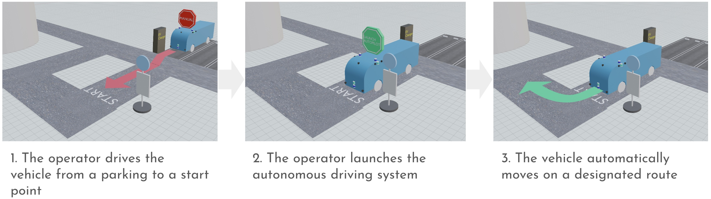

# Nighttime operation

During the nighttime (10pm - 1am), an in-car operator drives the vehicle from a parking lot to a start position and manually launches the autonomous driving system via HMI in the vehicle.

The system starts moving automatically on a route set by the in-car operator.

The in-car operator is while the system automatically operates.

