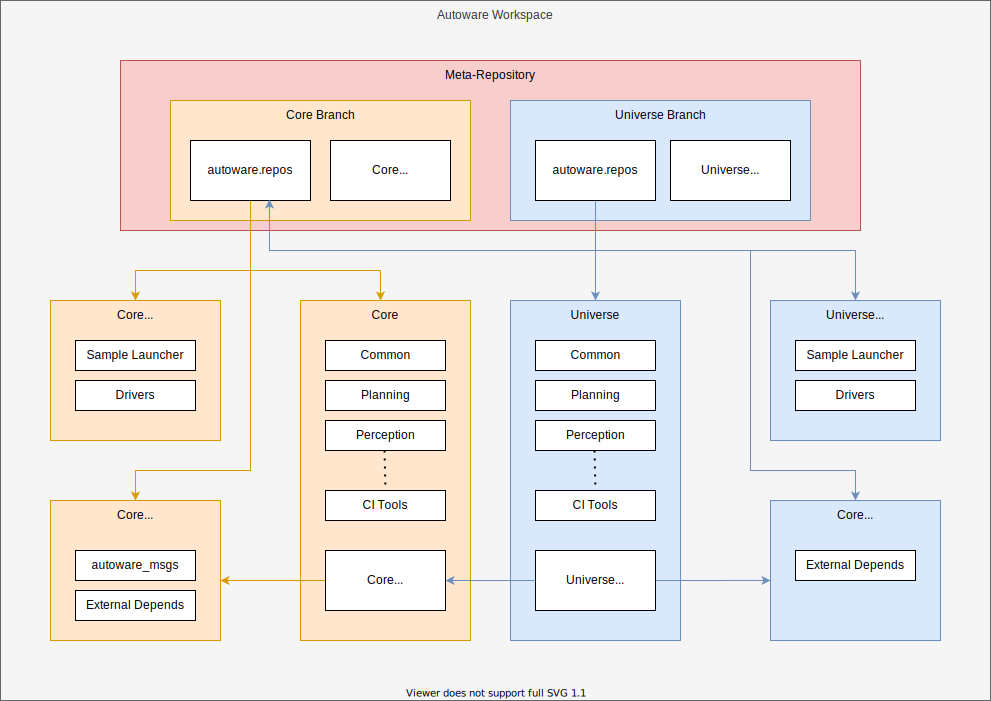

# Repository configuration

## Overview

This page shows the repository configuration of Autoware and its concepts.

!!! warning

    Note: This figure is tentative.

    TODO: Add documentations repositories, WG repositories, and autoware.org.

## Concepts

### Core/Universe architecture

Since Autoware is desired to be usable for production-level vehicles in the future, [Autoware.Auto](https://www.autoware.org/autoware-auto) has been used strict merge criteria.

However, since there is no specific requirements or specifications in Autonomous Driving, it's almost impossible to build a perfect product from the beginning.
We need prototyping phases to build a high-quality product, so we're doing ODD-based developments.

Then, doing every development in one branch causes slowing down of development speed or mixin of low-quality.
Also, forcing such a strict rules for all contributors will make them discourage from sending PRs.

Therefore, it's better to separate production level and high-quality code and prototyping level code.
Specifically, we define Core/Universe for this.

- Core defines the interfaces of Autoware
- Both Core and Universe refer to the interface
- Core has high-quality code
- Universe has experimental level code

With this, we aim to accomplish the following things.

- Contributors can feel free to send small PRs.
- We can keep high-quality for the Core code.
- We can rapidly build prototypes in Universe.
- We can develop a lot of extensions, including cutting-edge features, based on the interfaces.

### Definition of Core/Universe

Core

- Complete end-to-end autonomous driving framework
- Supports all current AWF ODDs
- Provides the definitions and the functionality for which other packages can extend
- Strict code and quality control
- Heavily managed by the AWF
- Stable base implementation

Universe

- Additional packages built on top of Core
- Extends Autoware functionality beyond the AWF ODDs
- Completely dependent on Core functionality and message definitions
- Relaxed code and quality control
- Community managed
- Enables quick experimentation and prototype testing

## Repositories and roles

Although some repositories might be added in the future, these are enough for explaining the core concept.

- [autowarefoundation/autoware](https://github.com/autowarefoundation/autoware)
  - This is a meta-repository that contains `.repos` files to construct a workspace.
  - Since it's prospected to be forked by users, we don't put a lot of information here to avoid unnecessary differences.
- [autowarefoundation/autoware_common](https://github.com/autowarefoundation/autoware_common)
  - This is a repository that contains ROS packages referenced in common by many repositories like libraries and utilities.
  - In order to reduce the CI execution time, splitting that kind of packages from a big repository is a good practice.
- [autowarefoundation/autoware.core](https://github.com/autowarefoundation/autoware.core)
  - This is a core repository that contains high-quality and stable ROS packages for Autonomous Driving.
  - Although it's almost empty at this time, it will be implemented based on [Autoware.Auto](https://gitlab.com/autowarefoundation/autoware.auto/AutowareAuto) and [Autoware.Universe](https://github.com/autowarefoundation/autoware.universe) during the next ODD project.
- [autowarefoundation/autoware.universe](https://github.com/autowarefoundation/autoware.universe)
  - This is a core repository that contains experimental but cutting-edge ROS packages for Autonomous Driving.
- [autowarefoundation/autoware_launch](https://github.com/autowarefoundation/autoware_launch)
  - This is a launch configuration repository that contains node configurations and their parameters.
- [autowarefoundation/autoware-github-actions](https://github.com/autowarefoundation/autoware-github-actions)
  - This is a repository for CI that contains [reusable workflows of GitHub Actions](https://docs.github.com/ja/actions/learn-github-actions/reusing-workflows).
  - Since Autoware has a lot of repositories in total, making CI scripts DRY(Don't Repeat Yourself) is efficient.
- [autowarefoundation/autoware-documentation](https://github.com/autowarefoundation/autoware-documentation)
  - This is a documentation repository for Autoware users and developers.
  - Since Autoware Core/Universe has multiple repositories, preparing a central documentation repository is more user-friendly than writing distributed documentation in each repository.

## FAQ

### Why don't use the meta-repository for documentation?

Since it's forked by many users, documentation changes would be noise during syncing repositories.

### Why [autoware.org](https://www.autoware.org/) isn't enough for documentation?

Since Software Engineers can't maintain it easily, it's hard to write a lot of information and keep up-to-date.

### Why both `autoware-documentation` and `autoware-reference-design (this site)` are required?

It's for a kind of separation of concerns. Too much information on one site makes confusion.

- `autoware-documentation` is mainly for users.
- `autoware-reference-design` is for core developers.
