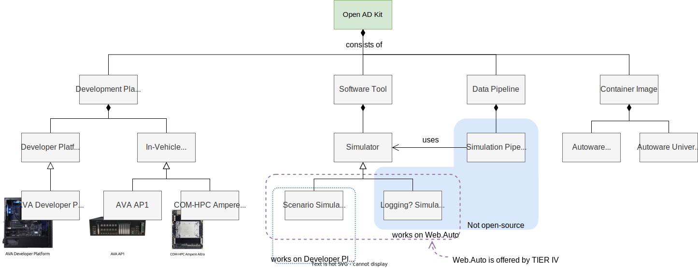
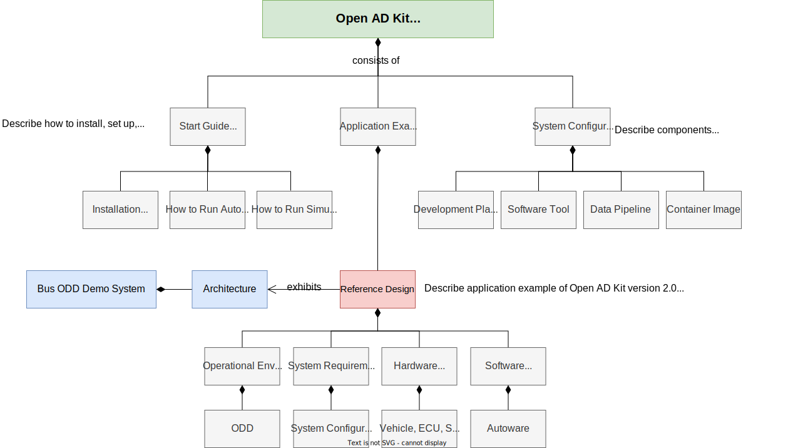

# Open AD Kit Documentation

!!! note "The latest version is 2.0, but it has not been officially released yet."

## About Open AD Kit

Open AD Kit aims to democratize autonomous drive (AD) systems by bringing the cloud and edge closer together. In doing so, Open AD Kit will lower the threshold for developing and deploying the Autoware software stack.

For more details about the Open AD Kit project, its goals and details of the Autoware Foundation working group that oversees the project, refer to the [Open AD Kit Working Group wiki](https://github.com/autowarefoundation/autoware-projects/wiki/Open-AD-Kit-working-group).

## Open AD Kit documentation structure

## Getting started

- [Start guide](start-guide) describes how to install, set up and run Autoware and its associated simulators on supported development platforms.
- [System configuration](system-configuration) describes the components that make up Open AD Kit in terms of the required hardware and software.
- [Application example](application-example) provides an actual application example for Open AD Kit that can be used as a reference for the development of other applications.

## Releases

[version 2.0](../version-2.0/index.md) **Latest**

[version 1.0](../version-1.0/index.md)
