# Run Autoware with CentOS 8 on Raspberry Pi 3

## Test configuration

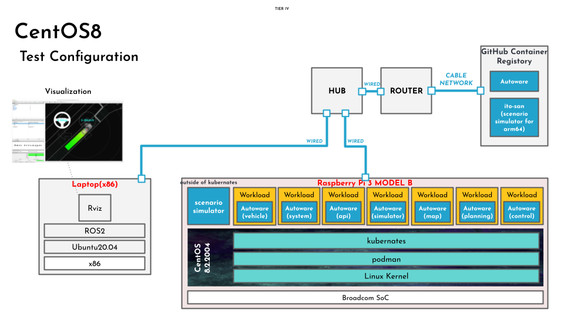

## Setup

1. Download OS image

   [CentOS-Userland-8-stream-aarch64-RaspberryPI-Minimal-4-sda.raw.xz](https://people.centos.org/pgreco/CentOS-Userland-8-stream-aarch64-RaspberryPI-Minimal-4/CentOS-Userland-8-stream-aarch64-RaspberryPI-Minimal-4-sda.raw.xz)

   ```console
   wget https://people.centos.org/pgreco/CentOS-Userland-8-stream-aarch64-RaspberryPI-Minimal-4/CentOS-Userland-8-stream-aarch64-RaspberryPI-Minimal-4-sda.raw.xz
   ```

1. Decompress OS image

   ```console
   7z e CentOS-Userland-8-stream-aarch64-RaspberryPI-Minimal-4-sda.raw.xz
   ```

1. Write OS image to SD card.

   ```console
   dd if=./CentOS-Userland-8-stream-aarch64-RaspberryPI-Minimal-4-sda.raw of=/dev/mmcblk0 bs=1M; sync
   ```

1. Put SD card into the slot and turn on Raspberry Pi.

   Then CentOS boots up.

   ```console
   CentOS Linux 8 (Core)
   Kernel 5.4.60-v8.1.e18 on an aarch64

   localhost login:
   ```

1. Login

   ```console
   localhost login: root
   Password: centos
   ```

1. Expand rootfs

   ```console
   rootfs-expand
   reboot
   ```

1. Login via SSH.

   SSH is preferred.<br>
   Find IP address of Raspberry Pi.

   ```console
   [root@localhost ~]# ip a
   1: lo: <LOOPBACK,UP,LOWER_UP> mtu 65536 qdisc noqueue state UNKNOWN group default qlen 1000
       link/loopback 00:00:00:00:00:00 brd 00:00:00:00:00:00
       inet 127.0.0.1/8 scope host lo
          valid_lft forever preferred_lft forever
       inet6 ::1/128 scope host 
          valid_lft forever preferred_lft forever
   2: eth0: <BROADCAST,MULTICAST,UP,LOWER_UP> mtu 1500 qdisc mq state UP group default qlen 1000
       link/ether dc:a6:32:07:af:24 brd ff:ff:ff:ff:ff:ff
       inet 192.168.0.76/24 brd 192.168.0.255 scope global dynamic noprefixroute eth0
          valid_lft 3177sec preferred_lft 3177sec
       inet6 fe80::12c7:5cee:c5a0:891f/64 scope link noprefixroute 
          valid_lft forever preferred_lft forever
   3: wlan0: <NO-CARRIER,BROADCAST,MULTICAST,UP> mtu 1500 qdisc fq_codel state DOWN group default qlen 1000
       link/ether 2e:21:fc:b3:30:c2 brd ff:ff:ff:ff:ff:ff
   ```

   Login via SSH from your host.

   ```console
   ssh root@192.168.0.76
   ```

## Install tools

1. Take a workaround for failure of `yum list updates`.

   `yum list updates` fails.
   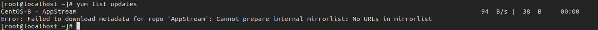

   So take a workaround for it.

   ```console
   sed -i 's/mirrorlist/#mirrorlist/g' /etc/yum.repos.d/CentOS-*
   sed -i 's|#baseurl=http://mirror.centos.org|baseurl=http://vault.centos.org|g' /etc/yum.repos.d/CentOS-*
   ```

   Execute `yum list updates`.

   ```console
   yum list updates
   ```

1. Install tools.

   ```console
   yum install -y podman wget zip
   ```

<br><br>

---

## Download kubernetes yaml files

Autoware.Universe runs as k3s clusters in Open AD Kit, so please download kubernetes yaml files to deploy Autoware to Raspberry Pi.
  
1. Download.

   ```console
   wget https://raw.githubusercontent.com/autowarefoundation/open-ad-kit-docs/proposal_v2.0/docs/start-guide/installation/deployments/comhpc-deployments.zip
   ```

1. Unzip it.

   ```console
   unzip comhpc-deployments.zip -d comhpc-deployments
   ```

   :speech_balloon: You will see the following files are unzipped.

   ```console
   Archive:  comhpc-deployments.zip
     inflating: comhpc-api-deployment.yaml  
     inflating: comhpc-control-deployment.yaml  
     inflating: comhpc-map-deployment.yaml  
     inflating: comhpc-persistent-volume.yaml  
     inflating: comhpc-persistent-volume-claim.yaml  
     inflating: comhpc-planning-deployment.yaml  
     inflating: comhpc-simulator-deployment.yaml  
     inflating: comhpc-system-deployment.yaml  
     inflating: comhpc-vehicle-deployment.yaml  
   ```

   Change `hostPath` for persistent volume.

   ```console
   vi ~/comhpc-deployments/comhpc-persistent-volume.yaml
   ```

   ```diff
    hostPath:
   -  path: "/home/root"
   +  path: "/root"

   ```

## Download map files

1. Download from Google Drive.

    ```console
    wget "https://drive.google.com/uc?export=download&id=1vWMLbmwJJE5tYO40ypCMxqtmgQPQxhiw&confirm=t&uuid=3d84d854-3dd2-4950-8cc8-248feeab547d" -O sample_data.zip
    ```

1. Unzip it.

   ```console
   unzip sample_data.zip
   ```

1. Copy `map` directory from `sample_data`.

   ```console
   cp -rf sample_data/map/ ~/
   ```

   :speech_balloon: You will see the following files are located.

   ```console
   root@ava:~# ls -la ~/map
   total 61288
   drwxrwxr-x 2 root root     4096 Aug 18 06:23 .
   drwx------ 6 root root     4096 Aug 18 06:23 ..
   -rw-r--r-- 1 root root  1841436 Aug 18 06:23 lanelet2_map.osm
   -rw-r--r-- 1 root root 60904720 Aug 18 06:23 pointcloud_map.pcd
   ```

1. Modify scenario file.

   ```console
   vi ~/sample_data/t4v2.yaml
   ```

   ```diff
      RoadNetwork:
        LogicFile:
   -      filepath: /home/mitsudome-r/Downloads/sample_data/lanelet2_map.osm
   +      filepath: /sample_data/map/lanelet2_map.osm
      SceneGraphFile:
   -      filepath: /home/mitsudome-r/Downloads/sample_data/pointcloud_map.pcd
   +      filepath: /sample_data/map/pointcloud_map.pcd
      TrafficSignals:
   ```

## Download **kernel configuration** file for tuning kernel parameters

We have to reconfigure kernel parameters by using `sysctl` for system stability.

1. Download.

   ```console
   wget -P /etc/sysctl.d https://raw.githubusercontent.com/autowarefoundation/open-ad-kit-docs/proposal_v2.0/docs/start-guide/installation/sysctl.d/60_cyclonedds.conf
   ```

1. Update kernel parameters.

   ```console
   sysctl -p /etc/sysctl.d/60_cyclonedds.conf
   ```

## Download configuration file of Cyclone DDS

In this test, we are using Cyclone DDS, so you also need to download configuration file of Cyclone DDS.

1. Download `cyclonedds.xml`.

   ```console
   wget -P ~/cyclonedds https://raw.githubusercontent.com/autowarefoundation/open-ad-kit-docs/proposal_v2.0/docs/start-guide/installation/cyclonedds/cyclonedds.xml
   ```

## Modify `cyclonedds.xml`

You need to change the element `NetworkInterfaceAddress` to the network interface currently in use.

1. Find network interface.

   :speech_balloon: You can find a network interface such as `eth0`.

   ```console
   [root@localhost ~]# ip a
   1: lo: <LOOPBACK,UP,LOWER_UP> mtu 65536 qdisc noqueue state UNKNOWN group default qlen 1000
       link/loopback 00:00:00:00:00:00 brd 00:00:00:00:00:00
       inet 127.0.0.1/8 scope host lo
          valid_lft forever preferred_lft forever
       inet6 ::1/128 scope host 
          valid_lft forever preferred_lft forever
   2: eth0: <BROADCAST,MULTICAST,UP,LOWER_UP> mtu 1500 qdisc mq state UP group default qlen 1000
       link/ether dc:a6:32:07:af:24 brd ff:ff:ff:ff:ff:ff
       inet 192.168.0.76/24 brd 192.168.0.255 scope global dynamic noprefixroute eth0
          valid_lft 3177sec preferred_lft 3177sec
       inet6 fe80::12c7:5cee:c5a0:891f/64 scope link noprefixroute 
          valid_lft forever preferred_lft forever
   3: wlan0: <NO-CARRIER,BROADCAST,MULTICAST,UP> mtu 1500 qdisc fq_codel state DOWN group default qlen 1000
       link/ether 2e:21:fc:b3:30:c2 brd ff:ff:ff:ff:ff:ff
   ```

1. Change the `NetworkInterfaceAddress`.

   ```console
   vi ~/cyclonedds/cyclonedds.xml
   ```

   For example; :page_facing_up: cyclonedds.xml

   ```diff
    <General>
   -  <NetworkInterfaceAddress>lo</NetworkInterfaceAddress>
   +  <NetworkInterfaceAddress>eth0</NetworkInterfaceAddress>
    </General>

   ```

## Run Autoware

1. Disable `firewalld` to enable ROS2 communication between pods and your host.

   ```console
   systemctl stop firewalld
   ```

1. Run all pods.

   ```console
   cd comhpc-deployments
   podman play kube comhpc-api-deployment.yaml
   ```

   It takes time for the first time to deploy due to pulling docker image from GHCR.
   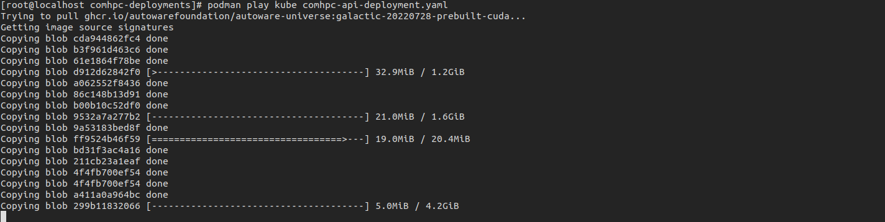

   1. After completion of pulling docker image, check if the pod runs.

      ```console
      podman ps -a
      ```

      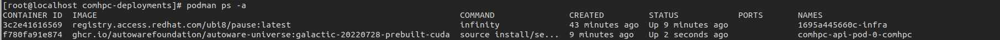

   1. Check if the pod runs without error.

      ```console
      podman attach comhpc-api-pod-0-comhpc
      ```

      **FIX ME: Getting the following error.**

      ```console
      ros2: can't open configuration file file:///etc/cyclonedds/cyclonedds.xml
      ```
  
      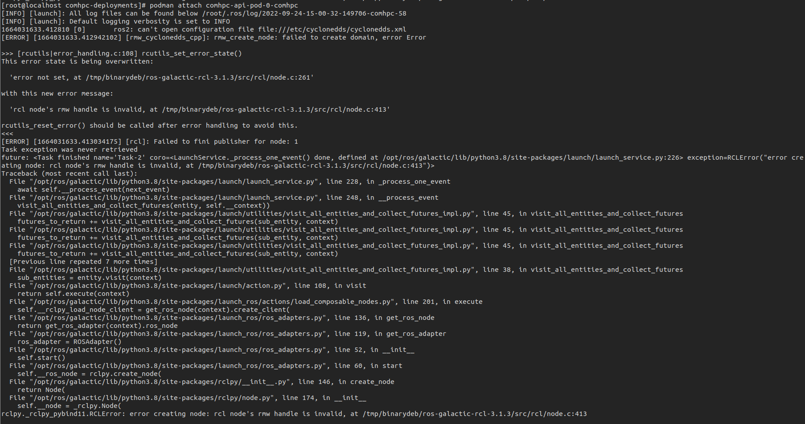

1. Workaround for `can't open configuration file`.

   1. Check persistent volume.

      ```console
      podman volume ls
      ```

      ```console
      podman volume inspect comhpc-pvc
      ```

      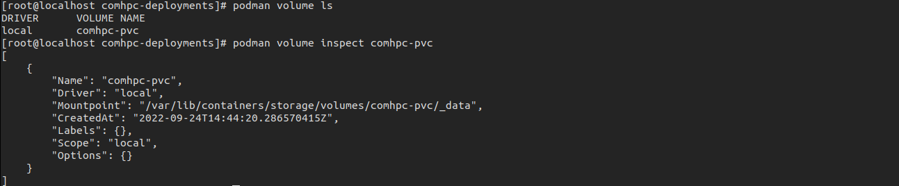

      No files are seen.
      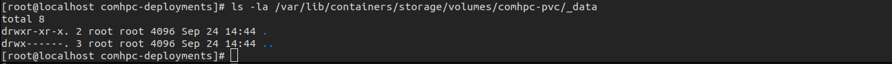

   1. Copy files.

      ```console
      cp ~/cyclonedds/cyclonedds.xml /var/lib/containers/storage/volumes/comhpc-pvc/_data
      ```

   1. Check if the pod runs without error again.

      ```console
      podman attach comhpc-api-pod-0-comhpc
      ```

      Verified the pod runs correctly.

      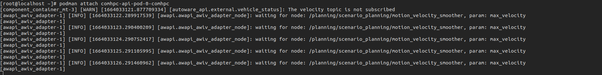

   1. Also map files should be copied.

      ```console
      cp ~/map/lanelet2_map.osm /var/lib/containers/storage/volumes/comhpc-pvc/_data
      cp ~/map/pointcloud_map.pcd /var/lib/containers/storage/volumes/comhpc-pvc/_data
      ```

      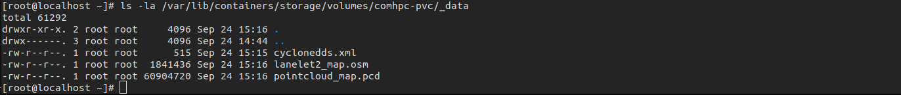

1. Run the rest of pods.

   ```console
   podman play kube comhpc-control-deployment.yaml
   podman play kube comhpc-map-deployment.yaml
   podman play kube comhpc-planning-deployment.yaml
   podman play kube comhpc-simulator-deployment.yaml
   podman play kube comhpc-system-deployment.yaml
   podman play kube comhpc-vehicle-deployment.yaml
   ```

   Finally we can see all pods are running.

   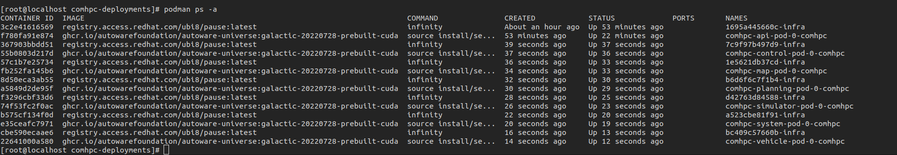

<br><br>

---

## Prepare visualization on your host

1. Follow the instructions.

   [Source installation - Autoware Documentation](https://autowarefoundation.github.io/autoware-documentation/main/installation/autoware/source-installation/)

1. After completion of source build, launch RViz.
 
   ```console
   rviz2 -d src/launcher/autoware_launch/autoware_launch/rviz/autoware.rviz 
   ```

   You can see the map shown in RViz.

   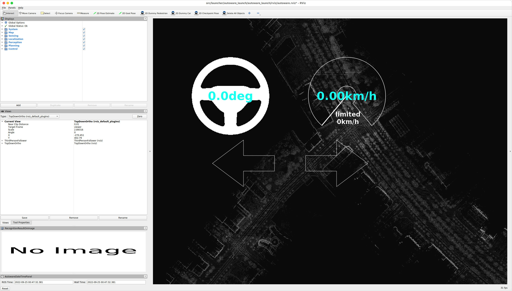

<br><br>

---

## Launch scenario simulator

1. Just run.

  ```console
  podman run --rm -it --net host --privileged -v ~/sample_data:/sample_data ghcr.io/ito-san/scenario_simulator_v2:galactic-arm64 ros2 launch scenario_test_runner scenario_test_runner.launch.py scenario:=/sample_data/t4v2.yaml architecture_type:=awf/universe launch_autoware:=false record:=false
  ```

  You can see scenario simulator runs.

  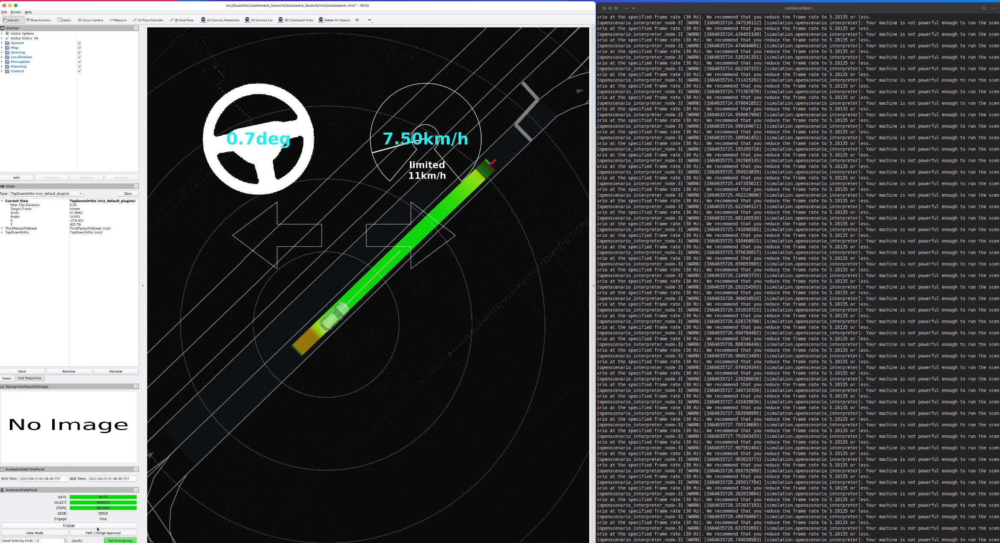

  