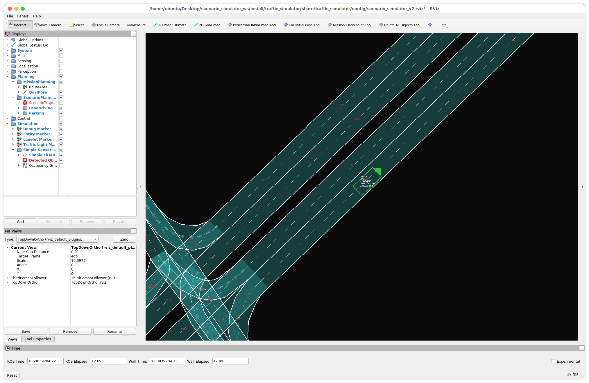
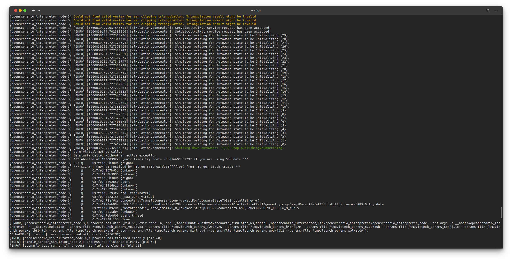

# Troubleshooting

## Scenario simulator stacks with `Simulator waiting for Autoware state to be Initializing`




### Workaround

Please restart kubernetes pods on the AVA Platform using the

```console
kubectl get deploy --output name | grep comhpc | xargs -n1 kubectl rollout restart
```
