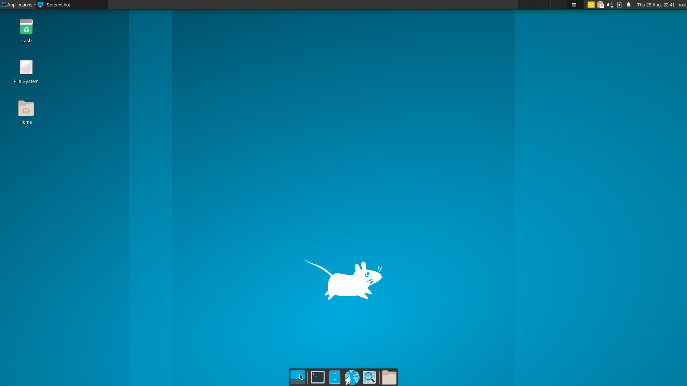
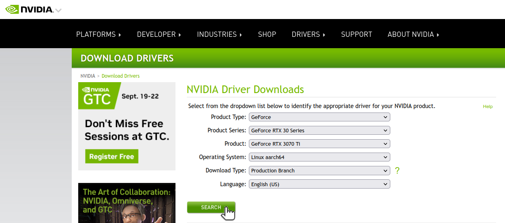
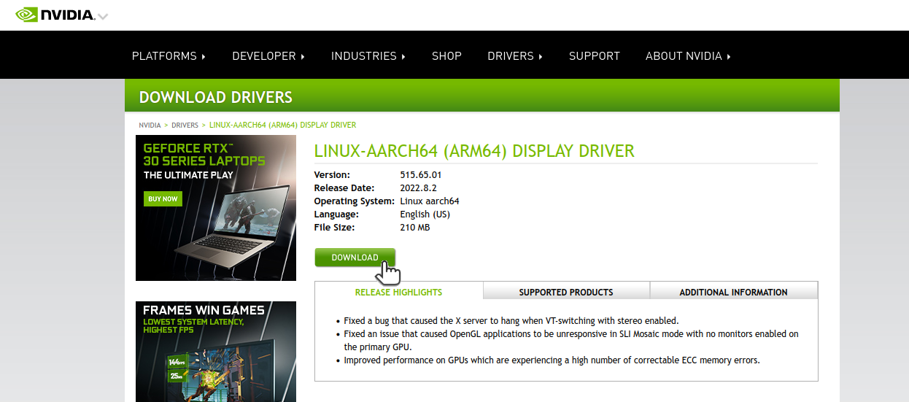
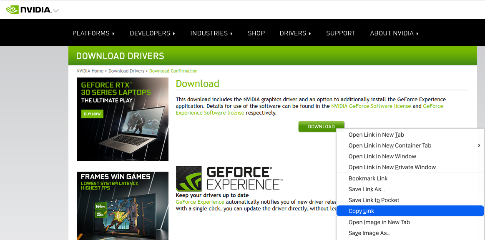
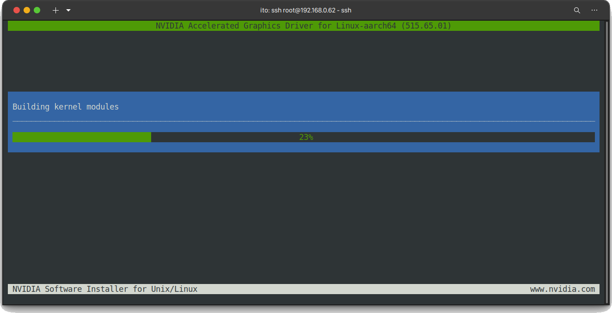
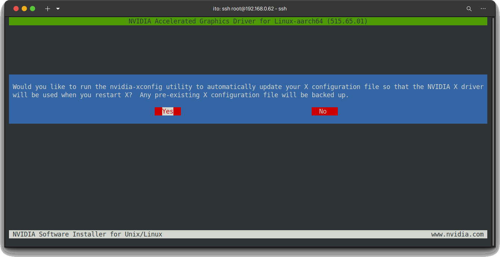
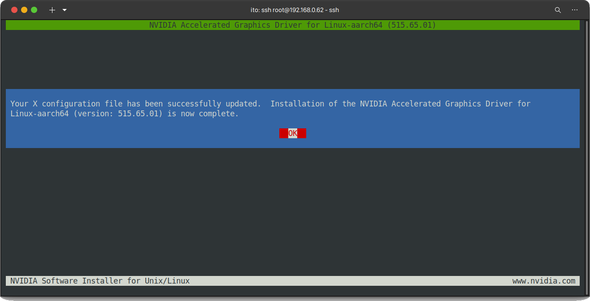

# Advanced setup for AVA Platform

## Overview

This instruction explains how to install advanced software for AVA platform.

1. Desktop environment(XFCE)
1. NVIDIA driver
1. NVIDIA Container Toolkit

## Checkout the repository for AVA platform

1. [m5p3nc3r / meta-ewaol-machine](https://github.com/m5p3nc3r/meta-ewaol-machine)

   ```console
   git clone git@github.com:m5p3nc3r/meta-ewaol-machine.git -b kirkstone-dev
   ```

1. Copy `meta-ewaol-ext` directory to the project root.

   ```console
   cp -rf meta-ewaol-machine/meta-ewaol-ext ~/meta-adlink-ampere
   ```

1. Download a missing patch in `meta-ewaol-ext` layer.

   ```console
   wget -P ~/meta-adlink-ampere/meta-ewaol-ext/recipes-ewaol/recipes-container/nvidia-container-toolkit/files https://raw.githubusercontent.com/autowarefoundation/open-ad-kit-docs/proposal_v2.0/docs/start-guide/installation/patch/0002-TEMPORARY-force-aarch64-rpm.patch
   ```

1. Modify `ava.yml`.

   ```diff
    header:
    version: 1
    includes:
       - repo: meta-ewaol
   -     file: meta-ewaol-config/kas/baremetal.yml
   +     file: meta-ewaol-config/kas/baremetal-sdk.yml

    repos:
    meta-ewaol:
       path: meta-ewaol

    meta-adlink-ampere:

   +meta-openembedded:
   +   path: layers/meta-openembedded
   +   layers:
   +      meta-oe:
   +      meta-gnome:
   +      meta-multimedia:
   +      meta-xfce:
   +
   +meta-ewaol-ext:
   +   path: meta-ewaol-ext  


    machine: ava

    bblayers_conf_header:
    base: |
       POKY_BBLAYERS_CONF_VERSION = "2"
       BBPATH = "${TOPDIR}"
       BBFILES ?= ""

   +local_conf_header:
   +meta-at: |
   +   XSERVER:append = " xserver-xorg-extension-glx xserver-xorg-module-libwfb xserver-xorg-module-exa"
   +   IMAGE_INSTALL:append = " packagegroup-core-x11 packagegroup-xfce-extended acpid xf86-video-modesetting mesa-demos nvidia-container-toolkit"
   +   DISTRO_FEATURES:append = " opengl x11 glx"
   +   PACKAGECONFIG:append:pn-xserver-xorg = " xinerama"
   +   IMAGE_FEATURES:append =" x11 x11-base"
   +   INSANE_SKIP:${PN}:append = " already-stripped"
   +   FILES:${PN}:append =" /usr/share/containers/oci/hooks.d/oci-nvidia-hook.json"

    target:
   -- ewaol-baremetal-image
   +- ewaol-baremetal-sdk-image
   ```

1. Build via kas.

   ```console
   kas build ava.yml
   ```

## Flash yocto image

For example;

```console
sudo bmaptool copy --bmap build/tmp_baremetal/deploy/images/ava/ewaol-baremetal-sdk-image-ava.wic.bmap build/tmp_baremetal/deploy/images/ava/ewaol-baremetal-sdk-image-ava.wic.gz /dev/sdb
```

## Extend rootfs partition

Follow the instructions [Extend rootfs partition](extend-rootfs.md).

## Boot your machine

You can see XFCE desktop.


## NVIDIA driver installation

1. Create the files required for compiling external modules.

   ```console
   cd /usr/src/kernel
   make modules_prepare
   ```

1. Check NVIDIA graphics card.

   ```console
   lspci | grep -i nvidia
   ```

   :speech_balloon: You can find a NVIDIA graphics card such as `GeForce RTX 3070 Ti`.

   ```console
   000d:01:00.0 VGA compatible controller: NVIDIA Corporation GA104 [GeForce RTX 3070 Ti] (rev a1)
   000d:01:00.1 Audio device: NVIDIA Corporation GA104 High Definition Audio Controller (rev a1)
   ```

1. Open the URL in browser.

   [Official Drivers NVIDIA](https://www.nvidia.co.jp/Download/index.aspx)

1. Select your graphics card, then click `SEARCH`.

   

1. Click `DOWNLOAD`.

   

1. Copy link to the file.

   

1. Download NVIDIA driver on AVA platform.

   For example;

   ```console
   wget https://jp.download.nvidia.com/XFree86/aarch64/515.65.01/NVIDIA-Linux-aarch64-515.65.01.run
   chmod +x NVIDIA-Linux-aarch64-515.65.01.run
   ```

1. Stop display manager to install NVIDIA driver.

   ```console
   systemctl stop xserver-nodm
   ```

1. Install NVIDIA driver.

   For example;

   ```console
   ./NVIDIA-Linux-aarch64-515.65.01.run
   ```

   Building kernel module starts.

   

1. Press :arrow_left: to select `Yes` and then press :leftwards_arrow_with_hook:.

   

1. Press :leftwards_arrow_with_hook:.

   

## Change display output from motherboard to GPU

You are using VGA, so switch to GPU.

1. Turn off AVA platform

1. Connect HDMI or Display Port from your graphics card to your monitor.

1. Change display mode to HDMI or Display Port on your monitor if needed.

1. Turn on AVA platform, then the desktop window will be shown via GPU.

## Confirm nvidia-docker works (Optional)

You can confirm nvidia-docker works by the following command.

```console
docker run --gpus all --rm nvidia/cuda-arm64:11.4.0-base nvidia-smi
```

You can see the outputs like below. 
```
root@ava:~# docker run --gpus all --rm nvidia/cuda-arm64:11.4.0-base nvidia-smi
Unable to find image 'nvidia/cuda-arm64:11.4.0-base' locally
11.4.0-base: Pulling from nvidia/cuda-arm64
55c604a74c4b: Pull complete 
657fae4b9575: Pull complete 
b2cf3c1bfea9: Pull complete 
71492f856142: Pull complete 
c74b3fce51ac: Pull complete 
Digest: sha256:625c8265d0f88d4250d48958113f1184f96db794fbe5d6d5cdd782f9916ec718
Status: Downloaded newer image for nvidia/cuda-arm64:11.4.0-base
Thu Aug 25 23:17:40 2022       
+-----------------------------------------------------------------------------+
| NVIDIA-SMI 515.65.01    Driver Version: 515.65.01    CUDA Version: 11.7     |
|-------------------------------+----------------------+----------------------+
| GPU  Name        Persistence-M| Bus-Id        Disp.A | Volatile Uncorr. ECC |
| Fan  Temp  Perf  Pwr:Usage/Cap|         Memory-Usage | GPU-Util  Compute M. |
|                               |                      |               MIG M. |
|===============================+======================+======================|
|   0  NVIDIA GeForce ...  Off  | 0000000D:01:00.0  On |                  N/A |
|  0%   35C    P8    18W / 290W |    234MiB /  8192MiB |      0%      Default |
|                               |                      |                  N/A |
+-------------------------------+----------------------+----------------------+
                                                                               
+-----------------------------------------------------------------------------+
| Processes:                                                                  |
|  GPU   GI   CI        PID   Type   Process name                  GPU Memory |
|        ID   ID                                                   Usage      |
|=============================================================================|
+-----------------------------------------------------------------------------+
```
