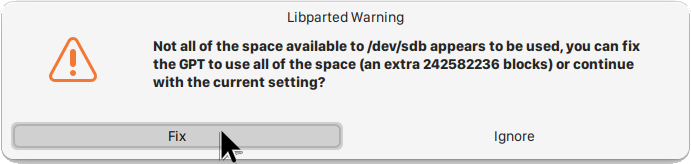
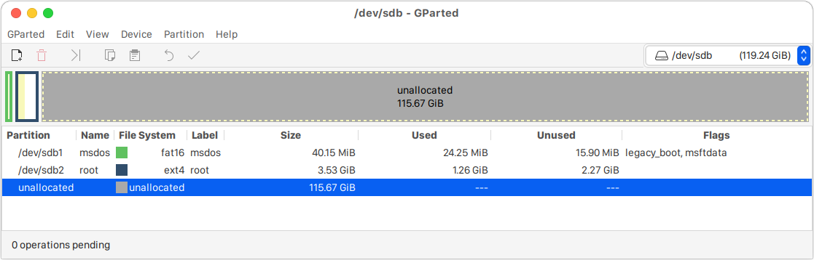
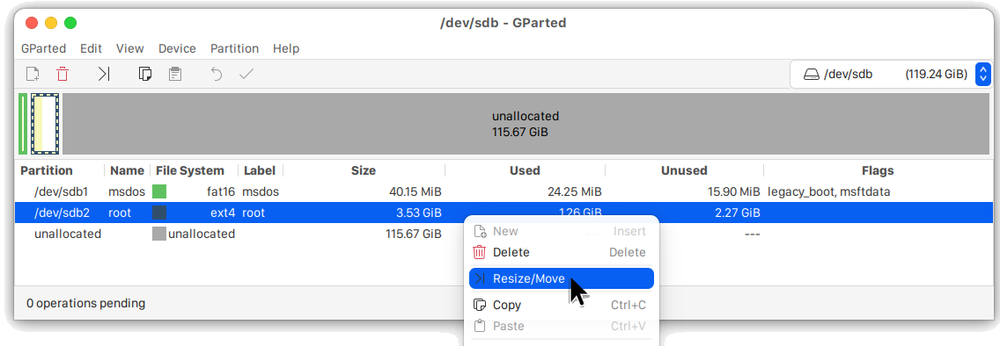
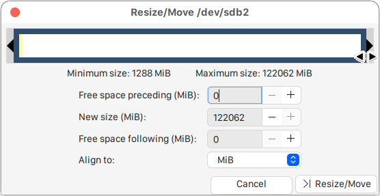
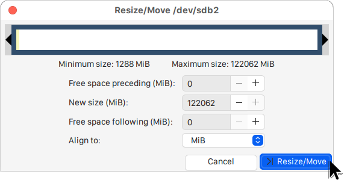
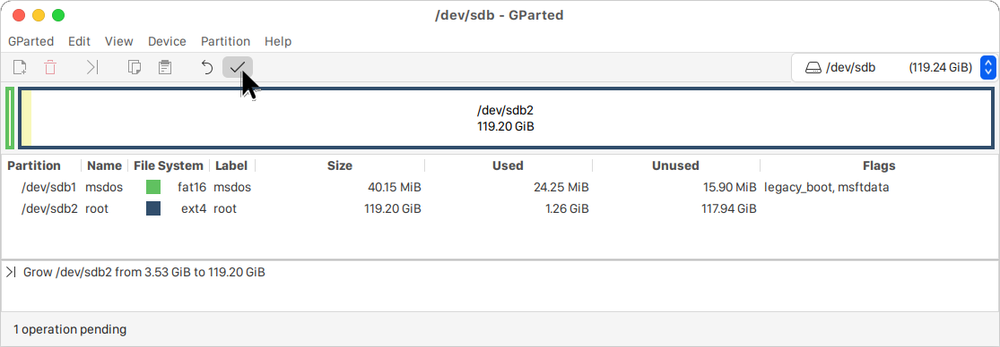
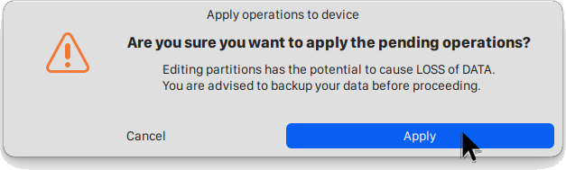
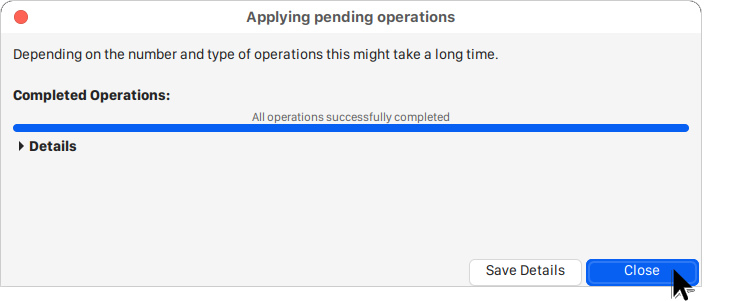

# Extend rootfs partition

## Overview

The rootfs partition is not fully occupied on M.2 SSD, and the size is too short to run k3s clusters.
So we have to extend rootfs partition.

Here is the instruction how to extend rootfs partition

## Extend rootfs

1. Run `gparted`.

   You may get the following warning when you run `gparted`.

   Press `Fix`.

   

   Contents of storage after we flashed yocto image to M.2 SSD.
   

1. Extend rootfs partition to the end of disk.

   Right click `root` partition, then click `Resize/Move`.
   

   Extend the square to the right end.

   
   

   Then, click `Resize/Move`.

   

1. Apply changes.

   Click check mark icon.

   

   Click `Apply`.

   

   Click `Close`.

   

   You can get rootfs as follows.

   
