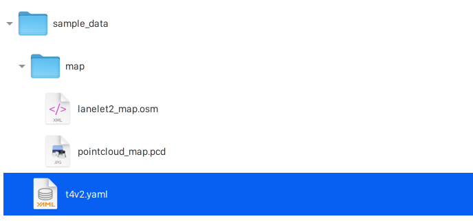
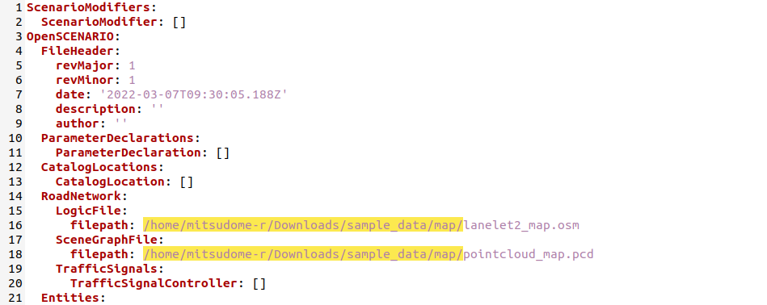

# System Setup on your host

## Overview

This instruction explains how to perform system setup for test execution on your host.

You need to copy docker images and necessary files.

## Download scenario simulator image to your host machine

The docker image of scenario simulator is registered in [GitHub Container Registry](https://github.com/tier4/scenario_simulator_v2/pkgs/container/scenario_simulator_v2)

1. Copy docker image to your host machine.

   ```console
   docker pull ghcr.io/tier4/scenario_simulator_v2:galactic
   ```

## Install nvidia-docker2 & Rocker

In this test, we try to run rviz inside docker, so please install nvidia-docker2 & Rocker.

:speech_balloon: This is quoted from [Scenario testing framework for Autoware: Run on Docker](https://tier4.github.io/scenario_simulator_v2-docs/user_guide/RunWithDocker/)

1. If you have NVIDIA GPU(s) in your machine, you have to install nvidia-driver and nvidia-docker2.

   ```console
   curl -s -L https://nvidia.github.io/nvidia-container-runtime/gpgkey | sudo apt-key add -
   curl -s -L https://nvidia.github.io/nvidia-container-runtime/ubuntu20.04/nvidia-container-runtime.list | \
     sudo tee /etc/apt/sources.list.d/nvidia-container-runtime.list
   sudo apt-get update
   sudo apt install -y nvidia-docker2
   sudo systemctl restart docker.service
   ```

1. Install Rocker

   ```console
   sudo pip3 install git+https://github.com/osrf/rocker.git
   ```

## Download map and scenario files

1. Download from Google Drive.

   ```console
   wget "https://drive.google.com/uc?export=download&id=1vWMLbmwJJE5tYO40ypCMxqtmgQPQxhiw&confirm=t&uuid=3d84d854-3dd2-4950-8cc8-248feeab547d" -O sample_data.zip
   ```

1. Unzip it.

   ```console
   unzip sample_data.zip
   ```

1. Open the scenario file named `t4v2.yaml` in `sample_data`.

   

1. Change the path to `lanelet2_map.osm` and `pointcloud_map.pcd`.

   

## Download **kernel configuration** file for tuning kernel parameters

We have to reconfigure kernel parameters by using `sysctl` for system stability.

1. Download.

   ```console
   wget -P /etc/sysctl.d https://raw.githubusercontent.com/autowarefoundation/open-ad-kit-docs/proposal_v2.0/docs/start-guide/installation/sysctl.d/60_cyclonedds.conf
   ```

1. Update kernel parameters.

   ```console
   sysctl -p /etc/sysctl.d/60_cyclonedds.conf
   ```

## Download configuration file of Cyclone DDS

In this test, we are using Cyclone DDS, so you also need to download configuration file of Cyclone DDS.

1. Download `cyclonedds.xml`.

   ```console
   wget -P ~/cyclonedds https://raw.githubusercontent.com/autowarefoundation/open-ad-kit-docs/proposal_v2.0/docs/start-guide/installation/cyclonedds/cyclonedds.xml
   ```

## Modify `cyclonedds.xml`

You need to change the element `NetworkInterfaceAddress` to the network interface currently in use.

1. Find network interface.

   ```console
   ip addr
   1: lo: <LOOPBACK,MULTICAST,UP,LOWER_UP> mtu 65536 qdisc noqueue state UNKNOWN group default qlen 1000
       link/loopback 00:00:00:00:00:00 brd 00:00:00:00:00:00
       inet 127.0.0.1/8 scope host lo
          valid_lft forever preferred_lft forever
       inet6 ::1/128 scope host
          valid_lft forever preferred_lft forever
    2: enp0s31f6: <BROADCAST,MULTICAST,UP,LOWER_UP> mtu 1500 qdisc fq_codel state UP group default qlen 1000
       link/ether 66:77:88:99:aa:bb brd ff:ff:ff:ff:ff:ff
       inet 192.168.10.1/24 brd 192.168.10.255 scope global noprefixroute enp0s31f6
          valid_lft forever preferred_lft forever
       inet6 fe80::f15d:4196:b777:6875/64 scope link noprefixroute
          valid_lft forever preferred_lft forever
    3: wlp82s0: <BROADCAST,MULTICAST,UP,LOWER_UP> mtu 1500 qdisc noqueue state UP group default qlen 1000
       link/ether cc:dd:ee:ff:00:01 brd ff:ff:ff:ff:ff:ff
       inet 192.168.0.28/24 brd 192.168.0.255 scope global dynamic noprefixroute wlp82s0
          valid_lft 3137sec preferred_lft 3137sec
       inet6 fe80::f493:f223:dfcc:bd1b/64 scope link noprefixroute
          valid_lft forever preferred_lft forever
    4: docker0: <NO-CARRIER,BROADCAST,MULTICAST,UP> mtu 1500 qdisc noqueue state DOWN group default
       link/ether 23:45:67:89:ab:cd brd ff:ff:ff:ff:ff:ff
       inet 172.17.0.1/16 brd 172.17.255.255 scope global docker0
          valid_lft forever preferred_lft forever
   ```

   :speech_balloon: You can find a network interface such as `enp0s31f6`.

1. Change the `NetworkInterfaceAddress`.

   ```console
   vi ~/cyclonedds/cyclonedds.xml
   ```

   For example; :page_facing_up: cyclonedds.xml

   ```diff
    <General>
   -  <NetworkInterfaceAddress>lo</NetworkInterfaceAddress>
   +  <NetworkInterfaceAddress>enp0s31f6</NetworkInterfaceAddress>
    </General>

   ```
