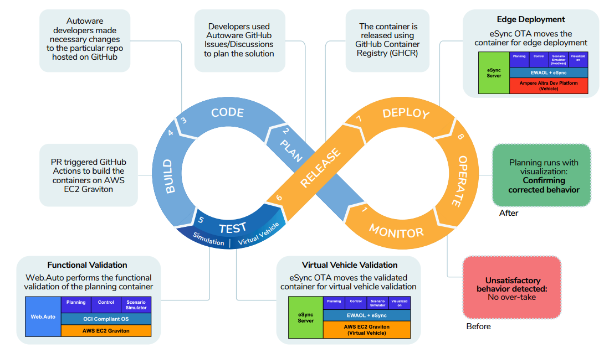

# Open AD Kit Documentation

!!! The latest version is 3.0, but it has not been officially released yet, but planned to be released at **Q1/2024**

## Open AD Kit: Containerized Workloads for the Autoware

 [The Open AD Kit](https://autoware.org/open-ad-kit/) is a collaborative project developed by [the Autoware Foundation](https://autoware.org/) and its member companies and alliance partners. It aims to bring software-defined best practices to the Autoware project and to enhance the Autoware ecosystem and capabilities by partnering with other organizations that share the goal of creating software-defined vehicles.

 Open AD Kit aims to democratize autonomous drive (AD) systems by bringing the cloud and edge closer together. In doing so, Open AD Kit will lower the threshold for developing and deploying the Autoware software stack by providing an efficient and modernized CI-CD approach.

For more details about the Open AD Kit project, its goals and details of the Autoware Foundation working group that oversees the project, refer to the [Open AD Kit Working Group wiki](https://github.com/autowarefoundation/autoware-projects/wiki/Open-AD-Kit-working-group).

## Getting started

- [Start guide](start-guide) describes how to install, set up and run **Open AD Kit v3.0** and its associated simulators on supported development platforms.
- [Application example](application-example) provides an actual application example for **Open AD Kit v3.0** that can be used as a reference for the development of other applications.

## Releases
[version 3.0](../version-3.0/index.md) **Will be officially released at Q1/2024**

[version 2.0](../version-2.0/index.md) **Obsolete**

[version 1.0](../version-1.0/index.md) **Obsolete**
