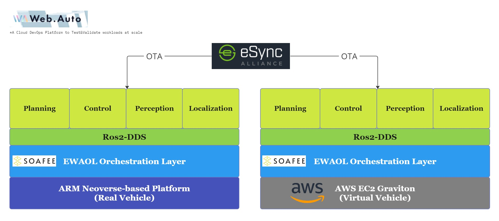

# Start guide

This page describes how to install, set up and run Autoware and its associated simulators on supported development platforms.

 

1. [Installation](installation/index.md) explains how to set up the development and runtime environment
1. [How to run Autoware](how-to-run-autoware/index.md) shows how to run Autoware on the development platform that are set up in the Installation chapter.
1. [How to run simulators](how-to-run-simulators/index.md) demonstrates how to run simulators that are set up in the Installation chapter.
